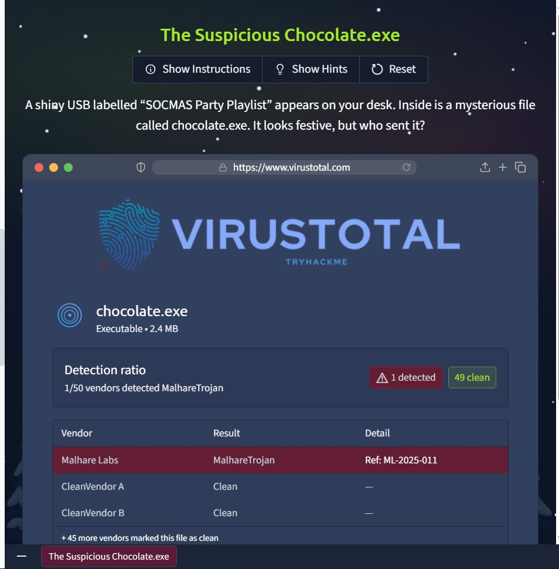
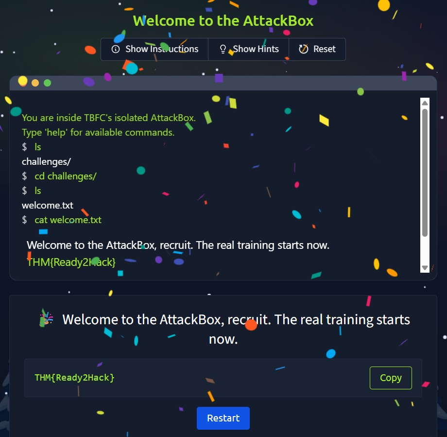

# Advent of Cyber Prep Track
Previous Task 1-5 does not have flag.

## Task 5 (Password Pandemonium)
Even McSkidy’s password was marked as unsafe. To continue, I had to prove that I understand how to create a strong password.

### What I had to do
The task was simple. I needed to create a password that follows all the security rules and is not already leaked anywhere.

### Steps I followed
1. First, I checked the password rules shown in the challenge  
2. I made sure the password was at least 12 characters long  
3. I added uppercase and lowercase letters  
4. I included numbers and special symbols  
5. I avoided using common or leaked passwords  
6. I entered the password and submitted it, but it was not accepting.
7. Thus, I understood that these rules explain best practices, not strict system checks  

### Flag
`THM{StrongStart}`


## Task6 (The Suspicious Chocolate.exe)
The task was to scan the file and decide if it was safe or not.


### Steps I followed
1. First, I opened the simulated VirusTotal tool  
2. I clicked on the Scan button  
3. The scan showed 49 clean results and 1 malicious result  
4. Based on this, I marked the file as dangerous  

### Flag
`THM{NotSoSweet}`


## Task 7 (Welcome to the AttackBox!)
The task was to navigate through the folders and read the correct file.

### Steps I followed
1. First, I used `ls` to see the available files and folders  
2. I noticed a folder named challenges  
3. I moved into it using `cd challenges/`  
4. Inside the folder, I found a file called welcome.txt  
5. I used `cat welcome.txt` to read the file  
6. The welcome message contained the flag  

### Flag
`THM{Ready2Hack}`


## Task 8 (The CMD Conundrum)
The goal was to list files properly and reveal hidden ones using CMD commands.

### Commands Used
```cmd
Microsoft Windows [Version 10.0.19045.4529]
(c) Microsoft Corporation. All rights reserved.

C:\Users\McSkidy> dir
 Directory of C:\Users\McSkidy

        readme.txt
 <DIR>  mystery_data

C:\Users\McSkidy> cd mystery_data

C:\Users\McSkidy\mystery_data> dir /a
 Directory of C:\Users\McSkidy\mystery_data

        notes.txt
        hidden_flag.txt

C:\Users\McSkidy\mystery_data> type hidden_flag.txt
THM{WhereIsMcSkidy}
```
### Flag
`THM{WhereIsMcSkidy}`


## Task 9 (Linux Lore)
The goal was to navigate to the correct folder and look for hidden files.

### Steps I followed
1. First, I moved to the home directory using `cd /home/mcskidy/`  
2. I used `ls -la` to list all files, including hidden ones  
3. I noticed a hidden file named .secret_message  
4. I read the file using `cat .secret_message`  
5. The hidden message displayed the flag  

### Commands Used
```bash
$ cd /home
$ cd mcskidy
$ ls -la
.secret_message  readme.txt
$ cat .secret_message
THM{TrustNoBunny}
```

### Flag
`THM{TrustNoBunny}`


## Task 10 (The Leak in the List)
The goal was to use a breach checker and find if the email was compromised.

### Steps I followed
1. First, I opened the breach checker tool  
2. I entered the email address mcskidy@tbfc.com  
3. One of the entries was marked as Compromised  
5. After selecting the correct option, the system accepted the answer  

### Flag
`THM{LeakedAndFound}`


## Task 11 (WiFi Woes in Wareville)

### Steps I followed
1. I logged into the router using admin as username and admin as password  
2. I opened the Security Settings page  
3. I set a new strong password that passed all checks  
4. The system confirmed the change and showed the flag  

### Flag
`THM{NoMoreDefault}`


## Task 12 (The App Trap)

### Steps I followed
1. I opened the list of connected apps  
2. I found an app with unusual permissions  
3. I revoked its access  
4. The system showed the flag  

### Flag
`THM{AppTrapped}`


## Task 13 (The Chatbot Confession)
### Steps I followed
1. I read each chatbot message carefully  
2. I selected the messages with sensitive information  
3. I submitted the correct choices  

### Flag
`THM{DontFeedTheBot}`


## Task 14 (The Bunny’s Browser Trail)
The task was to find the unusual User Agent that did not match normal browsers.

### Steps I followed
1. I checked all the HTTP log entries  
2. I compared them with common browsers like Chrome and Firefox  
3. I found one User Agent that looked suspicious  
4. I selected that entry and submitted it -
```
200 GET /admin/panel • BunnyOS (HopSecBot)
User-Agent: BunnyOS/1.0 (HopSecBot)
```
### Flag
`THM{EastmasIsComing}`
