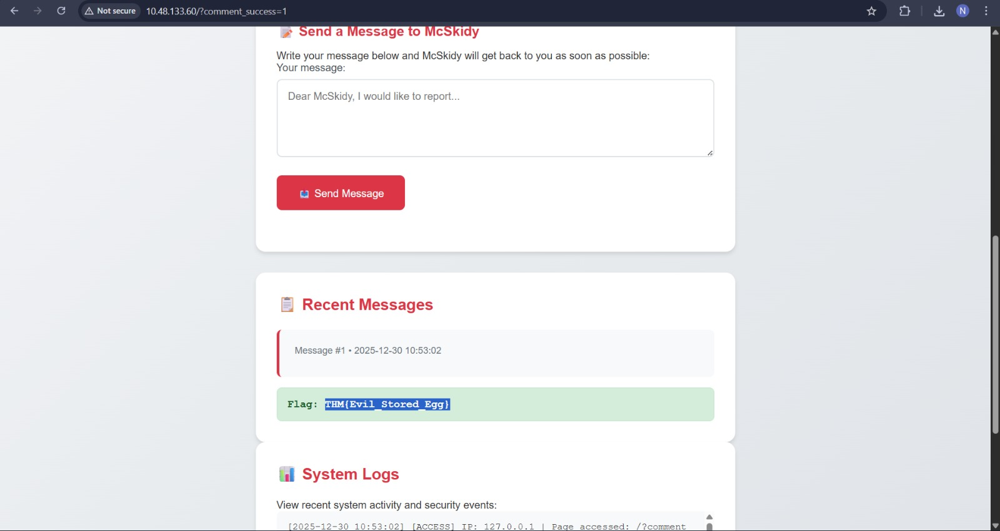
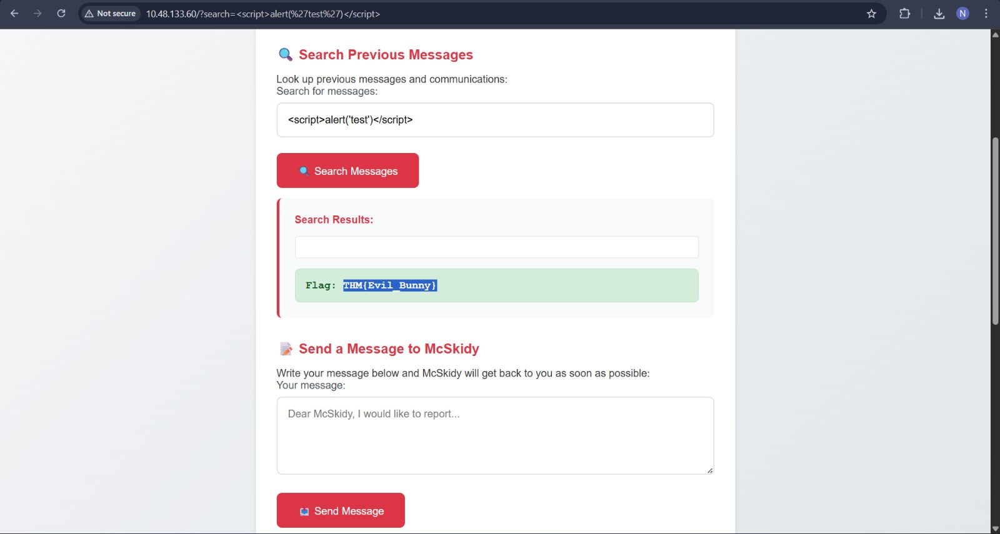

# XSS – Merry XSSMas

## Task 1 (Introduction)
I was asked to start the host machine and the AttackBox to begin the room.

### Steps
1. I started the host machine  
2. I started the OpenVPN...  
3. After both were running, I moved to the next task  

## Task 2 (Leave the Cookies, Take the Payload)
This task introduced Cross-Site Scripting (XSS) and explained how malicious JavaScript can be injected into web applications.

### Steps
1. I learned that XSS allows attackers to inject JavaScript into web pages  
2. I learned about reflected XSS, where payloads are passed through URL parameters (first flag)
3. I learned about stored XSS, where payloads are saved on the server and run for every user  (second flag)
    
4. For reflected XSS, I opened the browser developer tools  
5. I checked the Network tab and saw the search parameter being sent as `/?search=`(It was already written, but this assured me)
6. I injected a simple payload through the URL  
   `http://10.48.133.60//?search=`  

7. This triggered the alert and revealed the flag  
    
8. For stored XSS, I submitted a script payload that was saved on the server  
9. I used a basic payload  
   ``  

10. When the page loaded again, the script executed automatically and showed the flag  
    

### Answers
- Type of XSS used in the first scenario  
  `Stored`

- Flag from reflected XSS  
  `THM{Evil_Bunny}`

- Flag from stored XSS  
  `THM{Evil_Stored_Egg}`
