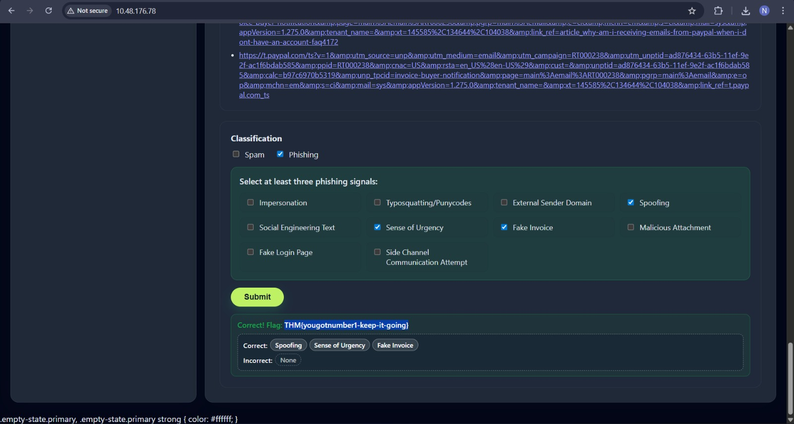

# Phishing – Phishmas Greetings

## Task 1 (Introduction)
I was asked to start the target machine to begin the room.

### Steps
1. I started the target machine (connected using OpenVPN)
2. After it was running, I moved to the next task  

## Task 2 (Spotting Phishing Emails)
This task focused on identifying phishing emails and understanding how attackers trick users using social engineering techniques.

### Steps
1. I learned what phishing is and how it differs from spam (I was to select any one option)
2. I understood how attackers use urgency, fear, and trust to manipulate users  
3. I learned about social engineering and how personal context is abused  
4. I learned about typosquatting and punycode to create lookalike domains(similar)
5. I learned how email spoofing works when authentication fails  
6. I learned how to check email headers like auth results and return path  
7. I learned that phishing emails can include malicious attachments (like .html files)
8. I understood that phishing is often about stealing credentials, not just malware  
9. I learned how trusted services like Dropbox or Google Drive are abused  
10. I saw examples of fake login pages that copy real websites (it was given in the challenge writeup)
11. I learned about side-channel communication are used...
    
12. I analyzed each email one by one and classified them...(got some incorrect but eventually got all...)  

### Answers
- **1st Email**  
  Categories: Impersonation, Spoofing, Sense of Urgency  
  Flag: `THM{yougotnumber1-keep-it-going}`

- **2nd Email**  
  Categories: Impersonation, Spoofing, Malicious Attachment  
  Flag: `THM{nmumber2-was-not-tha-thard!}`

- **3rd Email**  
  Categories: Impersonation, Social Engineering Text, Sense of Urgency  
  Flag: `THM{Impersonation-is-areal-thing-keepIt}`

- **4th Email**  
  Categories: Impersonation, External Sender Domain, Social Engineering Text  
  Flag: `THM{Get-back-SOC-mas!!}`

- **5th Email**  
  Categories: Spam  
  Flag: `THM{It-was-just-a-sp4m!!}`

- **6th Email**  
  Categories: Impersonation, Typosquatting/Punycode, Social Engineering Text  
  Flag: `THM{number6-is-the-last-one!-DX!}`
