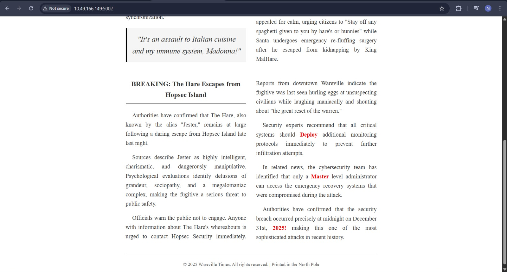

# Containers – DoorDasher's Demise

## Task 1 (Introduction)
I was asked to turn on the AttackBox and the host machine to begin the room.

### Steps
1. I started the OpenVPN  
2. I started the target machine  
3. After both were running, I moved to the next task  

## Task 2 (Container Security)
This task explained what containers are, how they differ from virtual machines, and why they are widely used in modern applications. (also about docker)

### Steps
1. I learned that containers share the host kernel and only isolate the application and its dependencies  
2. I understood that virtual machines run a full operating system, which makes them heavier than containers  
3. I learned that containers are faster and easier to scale  
4. I learnt about Docker as a popular and open-source container engine  
5. I learned that container escape is possible if misconfigurations exist  
6. I  first listed all running Docker containers  
    ```bash
    mrbombastic@tryhackme-2204:~$ docker ps
    CONTAINER ID   IMAGE                    COMMAND                  CREATED         STATUS         PORTS                                         NAMES
    36ec4b46df56   dasherapp:latest         "python app.py"          3 minutes ago   Up 3 minutes   0.0.0.0:5001->5000/tcp, [::]:5001->5000/tcp   dasherapp
    282b35842bc8   wareville-times:latest   "/docker-entrypoint.…"   3 minutes ago   Up 3 minutes   0.0.0.0:5002->80/tcp, [::]:5002->80/tcp       wareville-times
    8205e292ce64   uptime-checker:latest    "/docker-entrypoint.…"   3 minutes ago   Up 3 minutes   0.0.0.0:5003->80/tcp, [::]:5003->80/tcp       uptime-checker
    7c6cf0e25cae   deployer:latest          "tail -f /dev/null"      3 minutes ago   Up 3 minutes                                                 deployer
    ```
7. I observed multiple running containers including the deployer container
8. I learned that a `Dockerfile` is used to define instructions to build a Docker image
9. I followed the provided steps to access the Docker socket
10. Using this, I escaped the container and gained access to the host filesystem
11. I moved to the root directory
12. I located the flag file
13. I read the flag using cat
    ```bash
    deployer@323de6256237:/app$ whoami
    deployer
    deployer@323de6256237:/app$ ls
    deployer@323de6256237:/app$ cd ..
    deployer@323de6256237:/$ ls
    app  boot  etc       home  lib32  libx32  mnt  proc                root  sbin  sys  usr
    bin  dev   flag.txt  lib   lib64  media   opt  recovery_script.sh  run   srv   tmp  var
    deployer@323de6256237:/$ cat flag.txt
    THM{DOCKER_ESCAPE_SUCCESS}
    ```
14. I also checked the web service running on port 5002
15. The page revealed a secret password highlighted in red
    

### Answers
-   Command to list running Docker containers\
    `docker ps`
-   File used to define Docker image instructions\
    `Dockerfile`
-   Flag\
    `THM{DOCKER_ESCAPE_SUCCESS}`
-   Bonus: Secret password found on port 5002\
    `DeployMaster2025!`