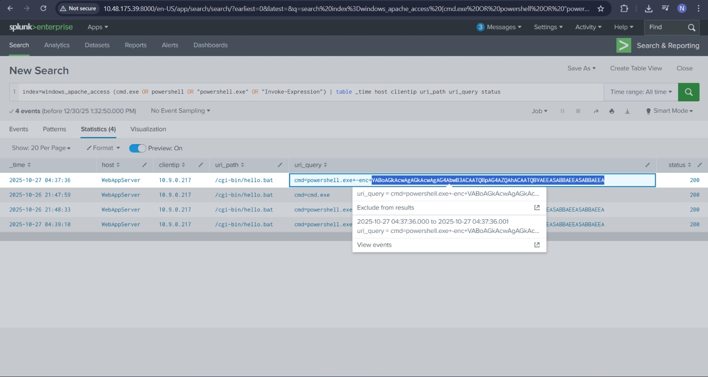

# Web Attack Forensics – Drone Alone

## Task 1 (Introduction)
I was asked to start the AttackBox and the host machine to begin the room.

### Steps
1. I started the OpenVPN and went to given URL...  
2. I started the target machine  
3. After both were running, I moved to the next task  

## Task 2 (Web Attack Forensics)
This task focused on investigating web attacks using Splunk by analyzing Apache logs and Sysmon data.

### Steps
1. I learned that Splunk stores and analyzes machine and application logs  
2. I was shown how attackers abuse web servers to execute system commands  
3. I searched Apache access logs for command execution attempts  
    ```spl
    index=windows_apache_access (cmd.exe OR powershell OR "powershell.exe" OR "Invoke-Expression")
    | table _time host clientip uri_path uri_query status
    ```
4. From the results, I noticed suspicious payloads including encoded strings
5. I learned that attackers often use Base64 encoding to hide commands which when using base64 decoder - got (T�h�i�s� �i�s� �n�o�w� �M�i�n�e�!� �M�U�A�H�A�A�H�A�A�)
    
6. I then checked Apache error logs to see failed command execution attempts
    ```
    index=windows_apache_error ("cmd.exe" OR "powershell" OR "Internal Server Error")
    ```
7. This helped confirm attempts that failed at the server side
8. Next, I moved to Sysmon logs to see process creation activity
9. I searched for processes by Apache
    ```
    index=windows_sysmon ParentImage="*httpd.exe"
    ```
10. This showed Apache spawning unusual child processes
11. I learned attackers often run whoami to check privileges
12. I searched for this behavior
    ```
    index=windows_sysmon *cmd.exe* *whoami*
    ```
13. I also searched for encoded PowerShell commands
    ```
    index=windows_sysmon Image="*powershell.exe" (CommandLine="*enc*" OR CommandLine="*-EncodedCommand*" OR CommandLine="*Base64*")
    ```
14. From these logs, I identified the suspicious executables used by the attacker

### Answers
-   First command executed by the attacker\
    `whoami.exe`
-   Malicious executable found in the logs\
    `powershell.exe`