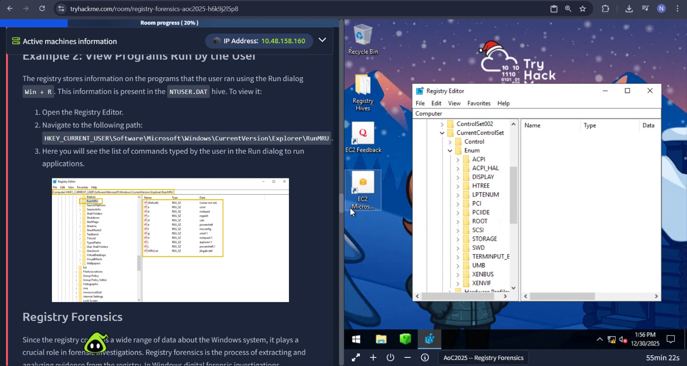

# Forensics – Registry Furensics

## Task 1 (Introduction)
I was asked to turn on the target machine to begin the room.

### Steps
1. I started the target machine  
2. After it was ready and I moved to the next task  

## Task 2 (Investigate the Gifts Delivery Malfunctioning)
This task explained what the Windows Registry is and how it can be used for forensic investigations.

### Steps
1. I learned that the Windows Registry stores system and user configuration data  
2. I was shown different registry hives and what type of data they contain  
3. I learned the actual registry paths used for common forensic checks (were many)
    
4. I opened the Registry Explorer tool  
5. I first loaded the SYSTEM hive to understand the structure  
6. I then referred to the provided forensic paths table  

7. I loaded the SOFTWARE hive along with its related LOG files since it was asked in first challenge question...
8. I opened the path using Load Hive option.
9. I reviewed the list of installed applications  
10. I found a suspicious application installed before the abnormal activity  
11. I checked the installation details to find the installer path  
12. I then reviewed execution-related registry entries  
13. I identified the command used to run the application in the background  

### Answers
- Suspicious application installed  
  `DroneManager Updater (Installed on 21 October)`

- Installer file path  
  `C:\Users\dispatch.admin\Downloads\DroneManager_Setup.exe`

- Command used to execute the program  
  `"C:\Program Files\DroneManager\dronehelper.exe" --background`
