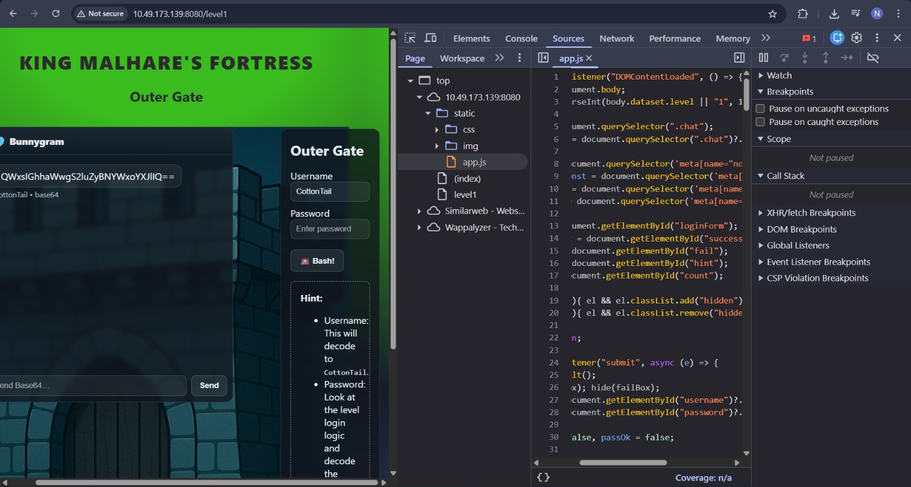
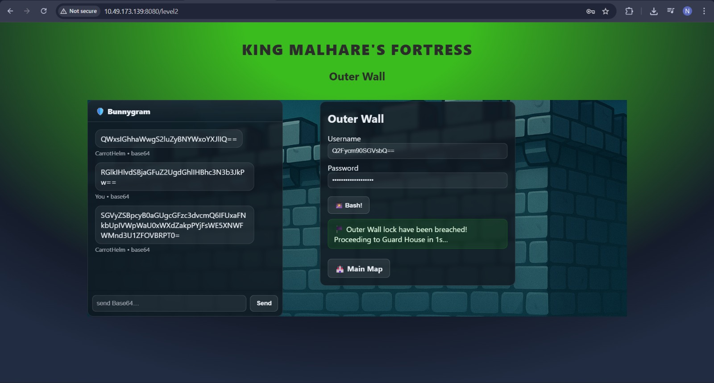
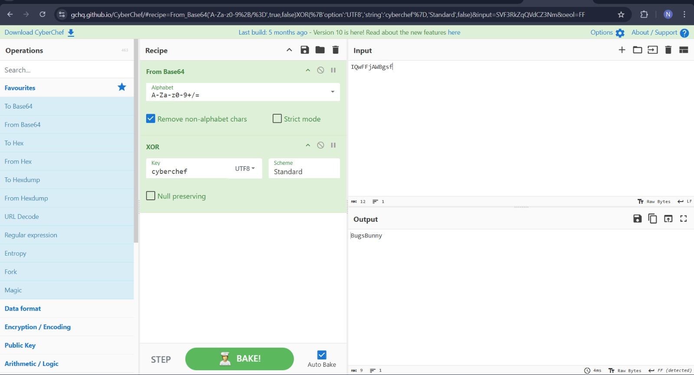
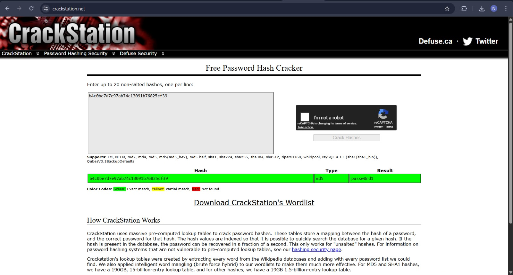
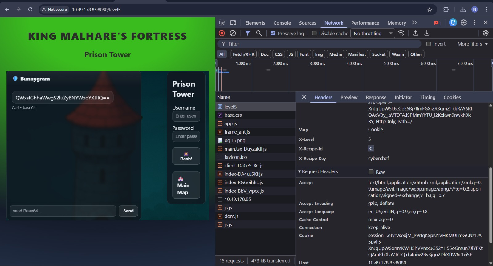
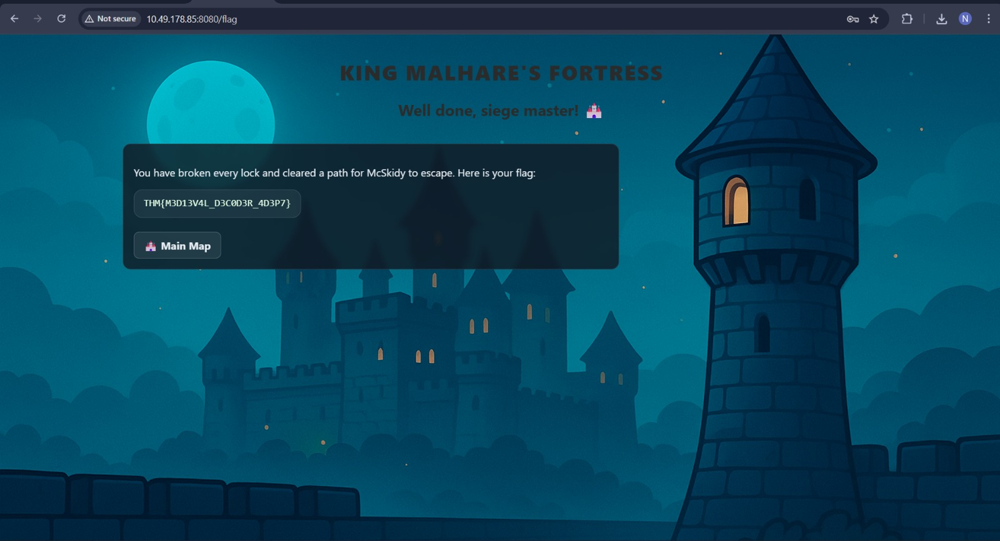

# CyberChef – Hoperation Save McSkidy

## Task 1 (Introduction)
I was asked to turn on the AttackBox and the target machine to begin the mission.

### Steps
1. I started the OpenVPN  
2. I started the target machine  
3. After both were running, I moved to the next task  

## Task 2 (Important Concepts)
This task explained the basics needed for the challenge.

### Steps
1. I learned the difference between encoding and encryption  
2. I learned that CyberChef is used for encoding, decoding, and reversing ciphers  
3. I was shown how to use browser DevTools and Inspect to view logic and headers  

## Task 3 (First Lock – Outer Gate)
This lock was based on Base64 and inspecting network headers.

### Steps
1. I opened the given URL in the browser  
2. I opened Normal Encoder/Decoder website in another tab  
3. I copied the username from the left panel and decoded it using Base64  
4. I checked the Network tab and copied the question from the headers 
     
5. I encoded the question and submitted it  
6. The response contained another Base64 string  
7. I decoded it and found the password  
    ```text
    SGVyZSBpcyB0aGUgcGFzc3dvcmQ6IFNXRnRjMjltYkhWbVpuaz0=
    Here is the password: SWFtc29mbHVmZnk=
    ```
8.  I decoded it to get the password  
    `Iamsofluffy`
9.  I encoded the guard username and proceeded
    

## Task 4 (Second Lock -- Outer Wall)
This lock again used Base64, but with an extra layer.

### Steps
1.  I followed the same steps as the previous lock
2.  I decoded the received Base64 string
3.  The decoded output was again Base64, so I decoded it once more
    ```text
    SGVyZSBpcyB0aGUgcGFzc3dvcmQ6IFUxaFNkbUpIVWpWaU0xWXdZakpPYjFsWE5XNWFWMnd3U1ZFOVBRPT0=
    Here is the password: U1hSdmJHUjViM1YwYjJOb1lXNW5aV2wwSVE9PQ==
    SXRvbGR5b3V0b2NoYW5nZWl0IQ==
    ```
4.  The final decoded password was  
    `Itoldyoutochangeit!`
5.  I encoded the new guard username and moved ahead

## Task 5 (Third Lock -- Guard House)
This lock introduced XOR along with Base64.

### Steps
1.  I entered Password Please as given in challenge question
2.  The guard returned an encoded string
3.  I reversed the string as hinted in the logic
4.  I decoded it using Base64 first
5.  Then I applied XOR in CyberChef using UTF-8
    ```text
    SGVyZSBpcyB0aGUgcGFzc3dvcmQ6IElRd0ZGakFXQmdzZg==
    Here is the password: IQwFFjAWBgsf
    ```
6.  This revealed the password\
    `BugsBunny`
    
7.  I encoded the guard name and continued

## Task 6 (Fourth Lock -- Inner Castle)
This lock was based on MD5 hashing.

### Steps
1.  I again sent `Password Please` again after encoding it
2.  I decoded the response using Base64
3.  The output was an hash
    ```text
    SGVyZSBpcyB0aGUgcGFzc3dvcmQ6IGI0YzBiZTdkN2U5N2FiNzRjMTMwOTFiNzY4MjVjZjM5
    Here is the password: b4c0be7d7e97ab74c13091b76825cf39
    ```
4.  I cracked the hash using CrackStation
    
5.  This gave the password  
    `passw0rd1`
6.  I encoded the guard name and moved forward

## Task 7 (Fifth Lock -- Prison Tower)
This final lock combined multiple techniques.

### Steps
1.  I encoded Password Please and sent it to the guard
2.  I decoded the received Base64 string
3.  I noticed from headers that this used the 2nd recipe(in cookies)
    
4.  I applied the following order in CyberChef
    -   Base64 to Hex(Decode)
    -   Hex to String
    -   Reverse String Hex
    ```text
    SGVyZSBpcyB0aGUgcGFzc3dvcmQ6IE56SXpNelppTmpNek1EWmpOREkyT0RZek16UXpNemN5TkRJM01qTXhNelU9
    Here is the password: NzIzMzZiNjMzMDZjNDI2ODYzMzQzMzcyNDI3MjMxMzU=
    72336b63306c42686334337242723135
    r3kc0lBhc43rBr15
    51rBr34chBl0ck3r
    ```
5.  The final password was  
    `51rBr34chBl0ck3r`
6.  I encoded the guard name and submitted it
7.  This revealed the final flag

### Final Flag 
`THM{M3D13V4L_D3C0D3R_4D3P7}`

