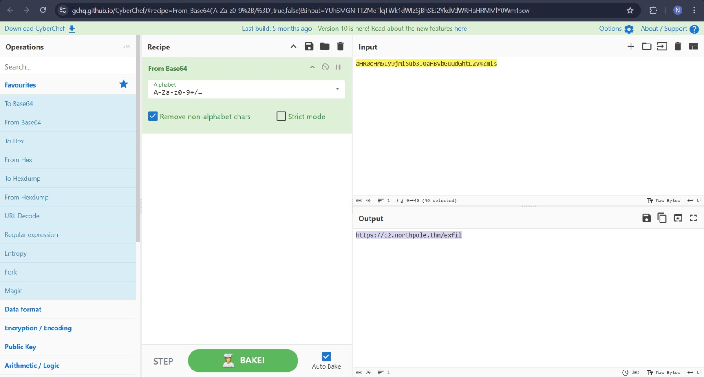
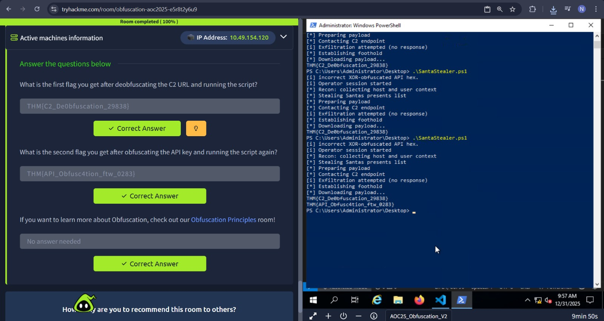

# Obfuscation – The Egg Shell File

## Task 1 (Introduction)
I was asked to start the target machine to begin the room.

### Steps
1. I started the target machine  
2. After it was running, I moved to the next task  

## Task 2 (Obfuscation & Deobfuscation)
This task explained what obfuscation is and how attackers use it to hide malicious logic and bypass detection.

### Steps
1. I learned that obfuscation is used to make code hard to read and analyze  
2. I saw a real-world example using XOR to obfuscate data  
3. I learned that deobfuscation means reversing these techniques  
4. I learned that CyberChef can be used to decode and deobfuscate data  
5. I also learned about the Magic option in CyberChef for unknown encodings  
6. For this challenge, I decoded the Base64 string provided in the script  
7. I replaced the decoded value back into the script  
8. I ran the script and obtained the first flag 
    
9. For the second part, I identified that XOR was being used  
10. I XOR’d the input using the key mentioned in the script (0x37)
    
11. I replaced the XOR-decoded(Hex with spaces) output back into the script  
12. I ran the script again to get the second flag  
    
### Answers
- First flag  
  `THM{C2_De0bfuscation_29838}`

- Second flag  
  `THM{API_Obfusc4tion_ftw_0283}`
