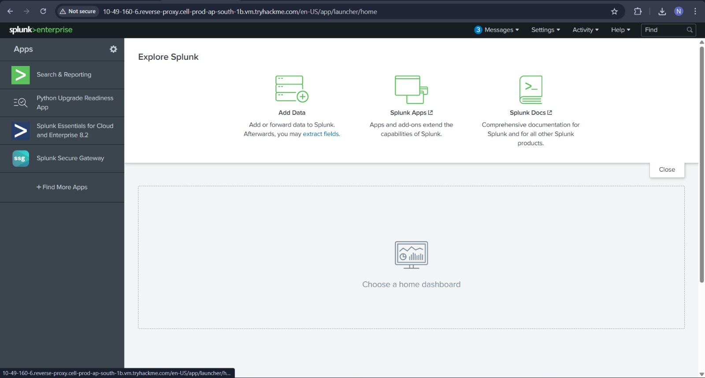
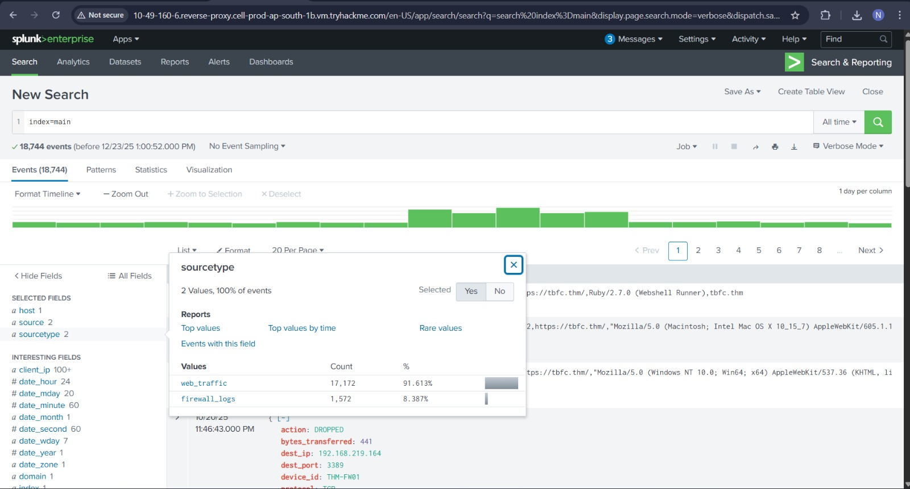
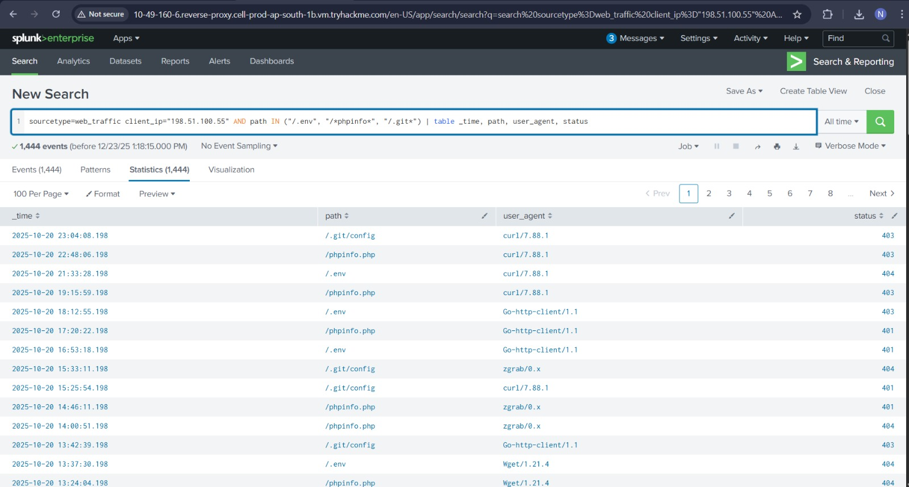
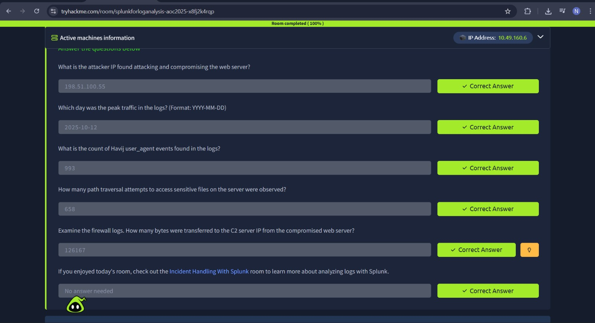

# Splunk Basics - Did you SIEM?

## Task 1 (Introduction)
I was asked to start the host machine and open the Splunk instance using the provided link.

### Steps I followed
1. I started the host machine  
2. I opened the Splunk web interface using the given URL  
3. I logged in and confirmed Splunk was running  

## Task 2 (Log Analysis with Splunk)
In this task, the log data was already ingested into Splunk. I was guided on how to search, filter, and analyze logs to trace an attacker.

### Steps I followed
4. I opened Search & Reporting.
5. I ran a basic search to see all web traffic  
   `index=main sourcetype=web_traffic`
    
6. I checked the timeline and noticed a traffic spike  
7. I visualized daily log volume  
   `index=main sourcetype=web_traffic | timechart span=1d count`
    
8. I sorted results to find the peak traffic day  
   `index=main sourcetype=web_traffic | timechart span=1d count | sort by count | reverse`

9. I reviewed important fields like `user_agent`, `client_ip`, and `path`  
10. I filtered out normal browser traffic  
    `user_agent!=*Mozilla* user_agent!=*Chrome* user_agent!=*Safari* user_agent!=*Firefox*`

11. I identified the main attacking IP  
12. I narrowed down the top suspicious IPs  
    `| stats count by client_ip | sort -count | head 5`

13. Similarly all... 

### Answers
- Attacker IP  
  `198.51.100.55`

- Peak traffic day  
  `2025-10-12`

- Havij user_agent count  
  `993`

- Path traversal attempts  
  `658`

- Bytes transferred to C2 server  
  `126167`

