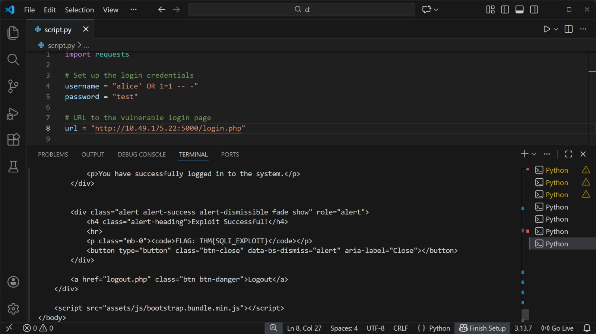
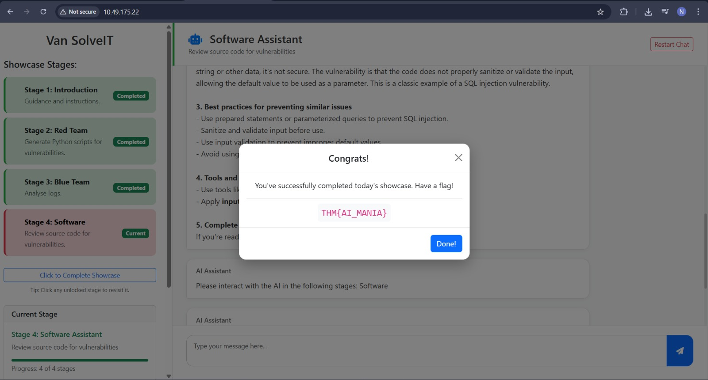

# AI in Security – old sAInt nick

## Task 1 (Introduction)
I was asked to start the AttackBox and the host machine to begin the task.

### Steps
1. I started the AttackBox(But my limit exceeded so I connected with OpenVPN)
2. I started the host machine  
3. After both were running, I moved to the next task  

## Task 2 (AI for Cyber Security Showcase)
This section explained how AI is used in cyber security today.

### Steps
1. I opened the given Machine-IP in browser.  
2. I interacted with the AI assistant called Van SolveIT  
3. The first stage only explained the three stages, so I clicked Complete Stag.
4. In the next stage, I asked the AI to generate a Python exploit  
5. I opened the terminal and used `nano` to create a file  
6. I selected the full code block using Ctrl+A and copied it  
7. I pasted the code into `script.py` using nano  
8. I edited the script and updated the target IP which was `10.49.175.22`.
9. I ran the script from the terminal in VS code.
10. The output showed the next flag.
    
11. I continued the same process for all remaining stages which was just to interact.
12. After completing all three stages, I received the final flag.
    

### Answers
- Flag after completing all AI showcase stages  
  `THM{AI_MANIA}`

- Flag after executing the exploit script  
  `THM{SQLI_EXPLOIT}`
