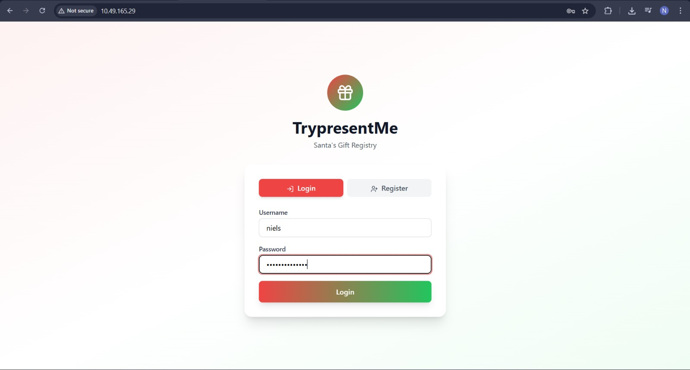
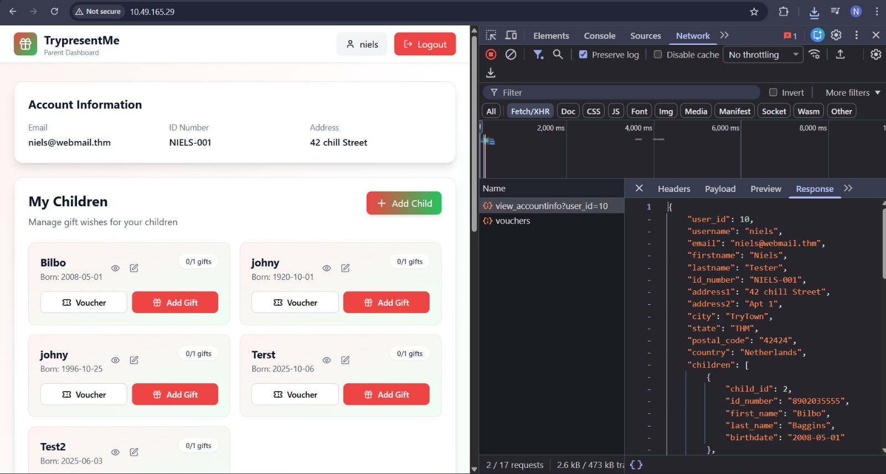
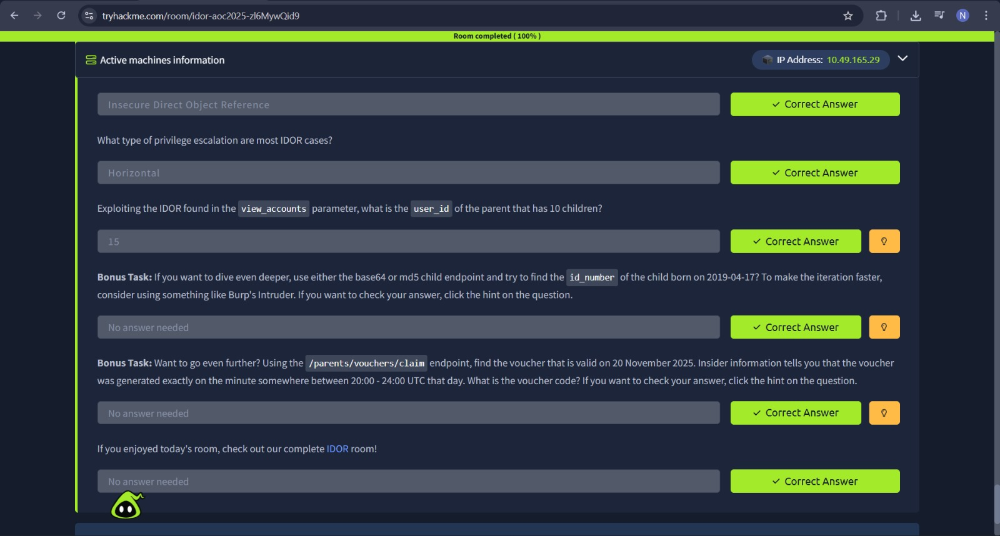

# IDOR – Santa’s Little IDOR

## Task 1 (Introduction)
I was asked to run the AttackBox and the host machine to begin the room. But I connected with OpenVPN.

### Steps
1. I started the VPN.  
2. I started the target machine  
3. After both were running, I moved to the next task  

## Task 2 (IDOR on the Shelf)
This task explained Insecure Direct Object Reference (IDOR) and how it can be abused when applications do not properly check if a user is allowed to access certain data.

### Steps
1. I logged in to the TrypresentMe website as a normal user  
    
2. I explored the sections for children, gifts, and vouchers  
3. I opened the browser developer tools and checked the Network tab  
4. I noticed the GET requests were using a userID parameter  
5. I went to Local Storage and found the stored user ID  
6. I changed the user ID value by increasing it one number at a time  
7. After refreshing, I could see data from other user accounts  
    
8. This allowed me to view children and vouchers that were not meant for my account  
9. I also noticed some data was stored using MD5 values  
10. Voucher IDs were using UUID v1, which is time-based and predictable 
11. By continuing trial and error, I found the account with 10 children(which was asked in the question)

### Answers
- What does IDOR stand for  
  `Insecure Direct Object Reference`

- What type of privilege escalation is this  
  `Horizontal`

- Which account had 10 children  
  `15`
  
