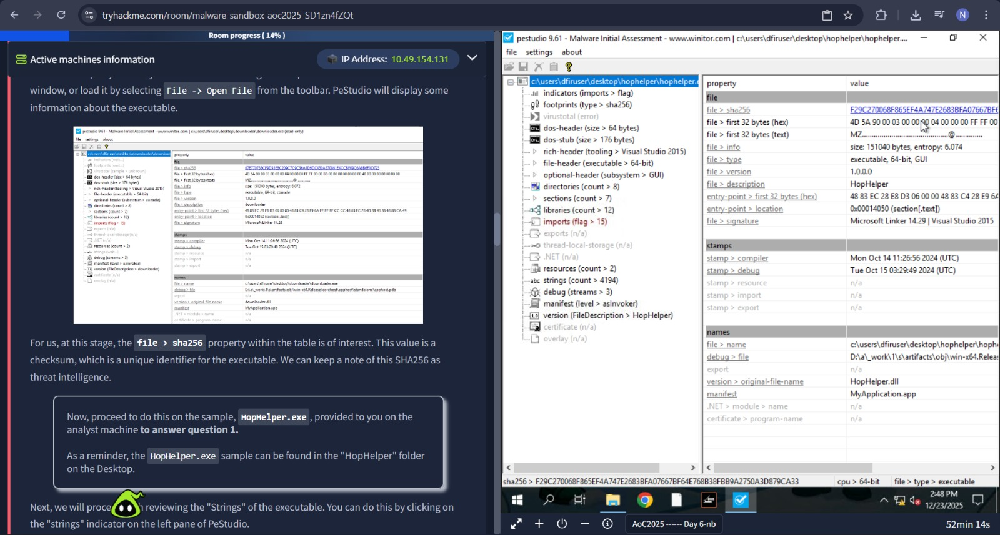
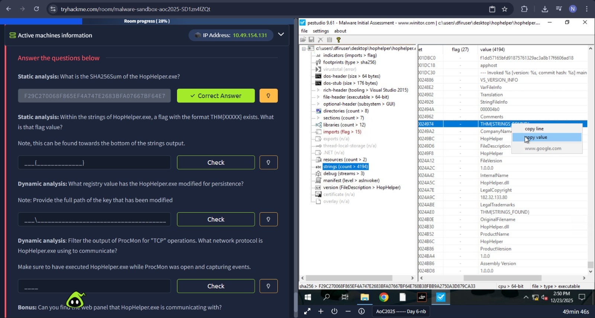
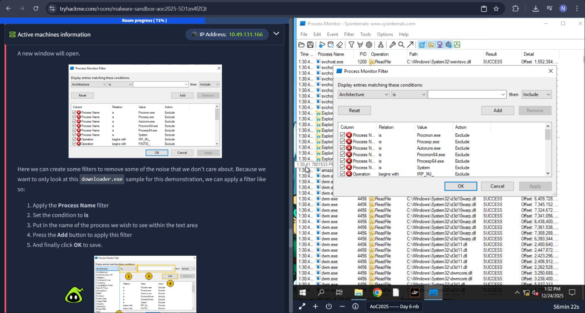

# Malware Analysis – Egg-xecutable

## Task 1 (Introduction)
I was given a short story and asked to start the host machine. After reading it, I started the machine and moved to the next task.

## Task 2 (Malware Analysis Using Sandboxes)
This task explained how sandboxes are used to safely analyze malware without affecting the real system.

### Steps
1. I learned that sandboxes are isolated environments used to run malware safely
  
2. I was introduced to static analysis and how it helps without executing the file  
3. I learned about checksums and how they are used to identify known malware  
4. I opened `HopHelper.exe` in PeStudio  
5. I checked the SHA256 hash value from PeStudio  
6. I moved to the **Strings** tab
  
7. I found the flag inside the strings(looked completely through it, there can be some better method)
8. Next, I learned about dynamic analysis  
9. I opened Regshot and took a registry snapshot before running the malware  
10. I executed `HopHelper.exe` inside the sandbox  
11. I took another registry snapshot after execution  
12. I compared both snapshots and found a new Run registry key(ehich was answer 3)
13. I then opened Process Monitor (ProcMon)  
14. I started capturing processes and ran `HopHelper.exe` again  
  
15. I paused the capture and added a filter  
16. I filtered by `Operation` contains `TCP`  
17. I filtered the process name to `HopHelper.exe`  
18. From the captured data, I observed that the malware was using HTTP connections  

### Answers
- SHA256 hash of HopHelper.exe  
  `F29C270068F865EF4A747E2683BFA07667BF64E768B38FBB9A2750A3D879CA33`

- Flag found in strings  
  `THM{STRINGS_FOUND}`

- Registry Run key added by malware  
  `HKU\S-1-5-21-1966530601-3185510712-10604624-1008\Software\Microsoft\Windows\CurrentVersion\Run\HopHelper`

- `http`