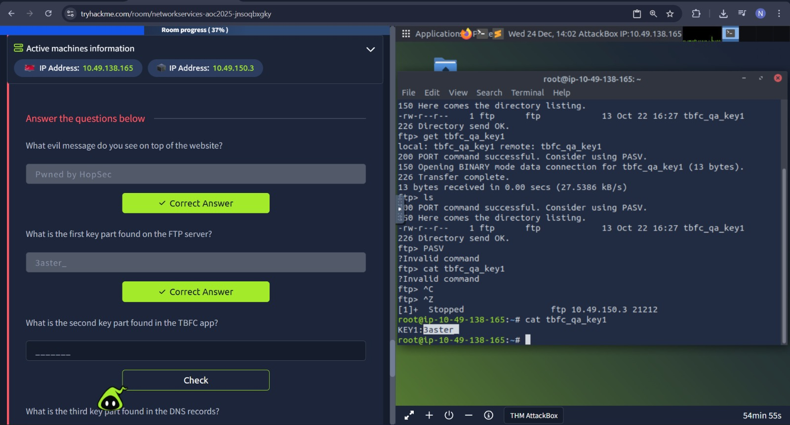
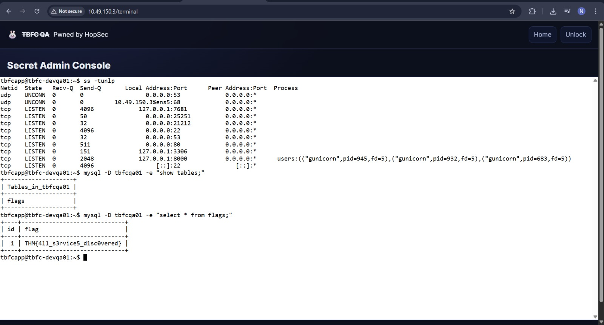

# Network Discovery – Scan-ta Clause

## Task 1 (Introduction)
I was asked to start the AttackBox and the host machine to begin the room.

## Task 2 (Discover Network Services)
This task focused on discovering open network services using port scanning and interacting with them to uncover hidden information.

### Steps
1. I first went through the provided network basics page  
2. I noted the target host IP address as `10.48.190.128`  
3. I started with a basic Nmap scan to find open ports  
   `nmap 10.48.190.128`

4. The scan showed two open ports  
   - Port 22 (SSH)  
   - Port 80 (HTTP)  

5. I opened the website using (after connecting through OpenVPN)
   `http://10.48.190.128`  

6. I then ran a full port scan with banner grabbing  
   `nmap -p- --script=banner 10.48.190.128`

7. This revealed additional services  
   - FTP running on port 21212  
   - A TBFC application running on port 25251  

8. I connected to the FTP service  
   `ftp 10.48.190.128 21212`  

9. I downloaded the first key using  
   `get tbfc_qa_key1`  
   

10. I connected to the TBFC application using netcat  
    `nc 10.48.190.128 25251`  

11. I used the `HELP` command and then `GET KEY`  
12. This revealed the second key  

13. I performed a UDP scan to look for open UDP ports  
    `nmap -sU 10.48.190.128`  

14. I found port 53 open, which is DNS  
15. I queried DNS to get the third key 
    `dig @10.48.190.128 TXT key3.tbfc.local +short`  

16. After entering all keys on the website, I gained admin access (key1+key2+key3)
17. On the server, I listed all listening ports  
    `ss -tunlp`  

18. I identified the SQL service running on the default port 3306  
19. I queried the database to get the final flag  
    `mysql -D tbfcqa01 -e "select * from flags;"`
    

### Answers
- Website message  
  `Pwned by HopSec`

- First key (FTP)  
  `tbfc_qa_key1`

- Second key (Netcat app)  
  Retrieved using `GET KEY`

- Third key (DNS)  
  Retrieved via TXT record query

- Default SQL port  
  `3306`
