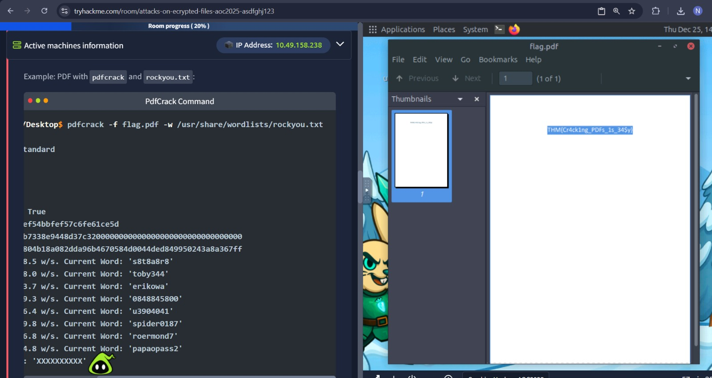

# Passwords – A Cracking Christmas

## Task 1 (Introduction)
I was asked to turn on the host machine to begin the task.

### Steps
1. I started the host machine (Attackbox) 
2. After it was ready, I moved to the next task  

## Task 2 (Attacks Against Encrypted Files)
This task explained different password cracking attacks like dictionary attacks and brute-force based mask attacks.

### Steps
1. I learned that dictionary attacks use wordlists to crack weak passwords.(I had some idea while in previous CTFs)
2. I learned that mask attacks try all possible character combinations  

3. To crack the PDF, I first extracted the hash  
   `pdf2john Desktop/flag.pdf > hash1.txt`

4. I used John the Ripper with a wordlist to crack the password  
   `john --wordlist=/usr/share/wordlists/rockyou.txt hash1.txt`

5. John revealed the password as `naughtylist`  
6. I opened the PDF using this password and found the first flag  
    
7. To crack the ZIP file, I extracted its hash  
   `zip2john Desktop/flag.zip > hash2.txt`

8. I again used John with the same wordlist  
   `john --wordlist=/usr/share/wordlists/rockyou.txt hash2.txt`

9. This revealed the ZIP password as `winter4ever`  
10. I extracted the ZIP file and found the second flag  

### Answers
- Flag inside the encrypted PDF  
  `THM{Cr4ck1ng_PDFs_1s_34$y}`

- Flag inside the encrypted ZIP file  
  `THM{Cr4ck1n6_z1p$_1s_34$yyyy}`
