# 1. Hide and seek
This challenge wants us to find hidden data within an image file. We have to use steganography techniques to find the secret information embedded in the image. 

## Solution:
1. I read the challenge description and recognized that it is related to steganography, particularly with the mention of "stegseek" in the givem description file in drive.
2. I started searching "stegseek" and discovered that it may need installation but is usually preinstalled in Kali Linux(which i am using).
3. To use it, I needed the syntax, which is:  
`stegseek [stegofile.jpg] [wordlist.txt]`(mentioned in official stegseek repository).
4. Next, I realized I required a wordlist for the cracking process. After some here and there searching, I found that the "rockyou" wordlist is commonly used and already available on Kali Linux in a specific path.
5. I navigated to the default location of wordlists: 
   ```bash
    ┌──(neels㉿neel)-[~/CustomQuesCryptonite/Forensics/HideandSeek]
    └─$ /usr/share/wordlists

    ┌──(neels㉿neel)-[/usr/share/wordlists]
    └─$ ls
    amass  dirbuster   fasttrack.txt  john.lst  metasploit  rockyou.txt.gz  wfuzz
    dirb   dnsmap.txt  fern-wifi      legion    nmap.lst    sqlmap.txt      wifite.txt
   ```
6. I extracted the zipped "rockyou" file using the command:
   ```bash
    ┌──(neels㉿neel)-[~/CustomQuesCryptonite/Forensics/HideandSeek]
    └─$ sudo gzip -d /usr/share/wordlists/rockyou.txt.gz
    [sudo] password for neels:
   ```
7. After extracting the file, I used stegseek with the command:
   ```bash
    ┌──(neels㉿neel)-[~/CustomQuesCryptonite/Forensics/HideandSeek]
    └─$ stegseek sakamoto.jpg /usr/share/wordlists/rockyou.txt
   ```
8. The output from stegseek indicated that it found a passphrase: "iloveyou1" and provided the original filename as "flag.txt".
9. It also stated that the extracted content is stored in a new file named "sakamoto.jpg.out".
10. I checked the newly created file, and it contained the flag.
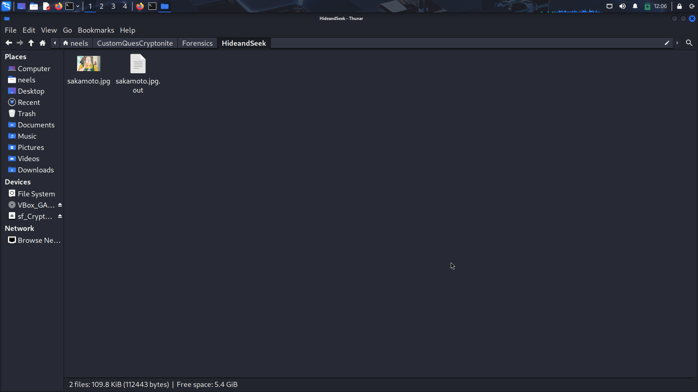
## Flag:
```
nite{h1d3_4nd_s33k_but_w1th_st3g_sdfu9s8}
```

## Concepts learnt:
- The significance of steganography and how it can be used to hide data within images.
- The utility of the stegseek tool for extracting hidden data using a wordlist.
- Using wordlist (like rockyou) in cracking password-protected steganographic files.

## Notes:
- Initially, I attempted to use binwalk on the image file, but it showed only 1 image.
- I mistakenly tried running stegseek on the zipped "rockyou" file, which resulted in an error indicating that it couldn't find a valid passphrase.
    ```bash
    ┌──(neels㉿neel)-[~/CustomQuesCryptonite/Forensics/HideandSeek]
    └─$ stegseek sakamoto.jpg /usr/share/wordlists/rockyou.txt.gz
    StegSeek 0.6 - https://github.com/RickdeJager/StegSeek

    [i] Progress: 35.20% (17.9 MB)

    [!] error: Could not find a valid passphrase.
    ```
    Thus after that I got to know that I have to first unzip it...

## Resources:
- [Stegseek Information](https://medium.com/@ria.banerjee005/steganography-tools-techniques-bba3f95c7148) - I got to know that what stegseek is...
- [stegseek GitHub Repository](https://github.com/RickdeJager/stegseek)


# 2. Nutrela Chunks
This challenge involves repairing a corrupted PNG image file. The description hints that there are issues with its structure and chunks. The goal is to reconstruct it back to a valid PNG format so that it can be properly rendered, revealing the  to get the flag.

## Solution:
1. Firts, upon opening the image an error message stated that it was "Not a png file". After reading the description I realised that I need to edit the hex of this `.png` file as it was written about some chunks.
   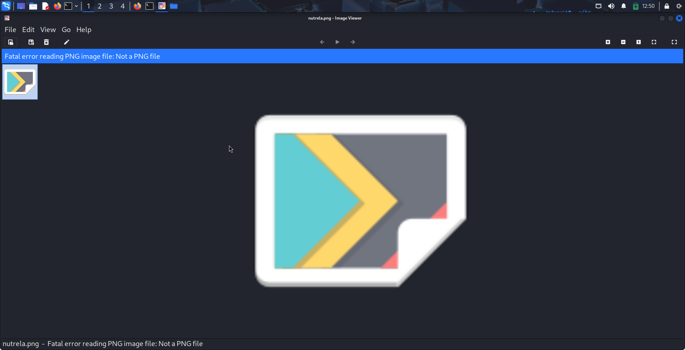
2. I read about PNG structure from a medium blog and got to know about that it consists of a file signature, followed by chunks such as `IHDR, IDAT, and IEND`.
3. I discovered the `pngcheck` command-line tool(while searching how to find errors in a pngfile), which can validate PNG files. So I installed this on my Kali Linux machine using:
   ```bash
   sudo apt install pngcheck
   ```
4. Running `pngcheck` on `nutrela.png`, I received the error indicating that it was neither a PNG nor a valid stream:
   ```bash
   ┌──(neels㉿neel)-[~/CustomQuesCryptonite/Forensics/NutrelaChunks]
   └─$ pngcheck nutrela.png
   nutrela.png  this is neither a PNG or JNG image nor a MNG stream
   ERROR: nutrela.png
   ```
5. The output suggested that the file signature was itself incorrect. So I changed the file signature to .png format. First I opened the file using hex editor:
   ```bash
   ┌──(neels㉿neel)-[~/CustomQuesCryptonite/Forensics/NutrelaChunks]
   └─$ hexedit nutrela.png
   ```
6. I changed the first four bytes from `89 70 6E 67` to `89 50 4E 47`. After saving the changes using `Ctrl+X`, I ran `pngcheck` again.
   ```bash
   ┌──(neels㉿neel)-[~/CustomQuesCryptonite/Forensics/NutrelaChunks]
   └─$ pngcheck nutrela.png
   nutrela.png  first chunk must be IHDR
   ERROR: nutrela.png
   ```
7. The new output indicated the first chunk must be IHDR. I changed the 4 bytes next to the IHDR string from `69 68 64 72` to `49 48 44 52`.
8. Checking with `pngcheck` again revealed an illegal reserved-bit-set chunk for IDAT.
   ```bash
   ┌──(neels㉿neel)-[~/CustomQuesCryptonite/Forensics/NutrelaChunks]
   └─$ pngcheck nutrela.png
   nutrela.png  illegal reserved-bit-set chunk idat
   ERROR: nutrela.png
   ```
9. I then modified the IDAT chunk by changing the four bytes from `69 64 61 74` to `49 44 41 54`. I ran the pngcheck again.
   ```bash
   ┌──(neels㉿neel)-[~/CustomQuesCryptonite/Forensics/NutrelaChunks]
   └─$ pngcheck nutrela.png
   nutrela.png  illegal reserved-bit-set chunk iend
   ERROR: nutrela.png
   ```
   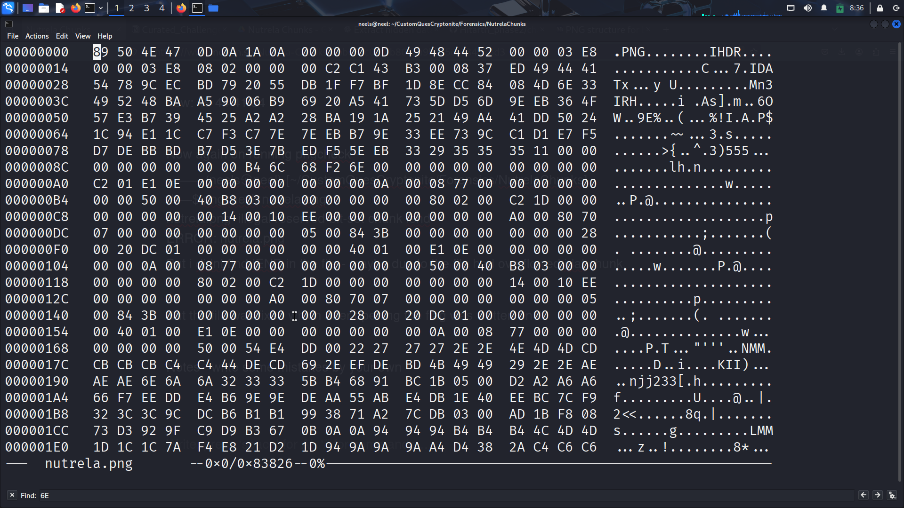
10. After several checks to change IEND chunk, but I was not able to locate it, So possibly due to an overflow of the IDAT chunk, maybe IEND has corrupted.
11. Despite this, the file was now opening correctly in which the flag was written.

## Flag:
```
nite{n0w_y0u_kn0w_ab0ut_PNG_chunk5}
```

## Concepts learnt:
- Understanding the structure of PNG files including various chunks such as IHDR, IDAT, IEND.
- Importance of file signatures.
- Chunks in PNG files are case-sensitive, affecting how the file is interpreted(Got to know while changing from ihdr to IHDR).
- Usage of `pngcheck` for locating errors in PNG files.
- Familiarity with hex editors for manipulating file byte structure directly.

## Notes:
- Initially, I misread the file signature and spent extra time figuring out which parts needed modification.
- While trying to find the IEND, I mistakenly thought it would be located similarly to the other chunks, but it was not visible anywhere in the whole hex file.

## Resources:
- [Medium blog on PNG structure](https://medium.com/@0xwan/png-structure-for-beginner-8363ce2a9f73)
- `man pngcheck` for more information on the command and its use
- Various online searches related to PNG corruption and recovery techniques.


# 3. RAR of the Abyss
The challenge revolves around analyzing a network capture file in order to decrypt a RAR file to get the flag.

## Solution:
1. First, I opened the provided `.pcap` file using Wireshark, a tool I was familiar with from previous CTF challenges.
   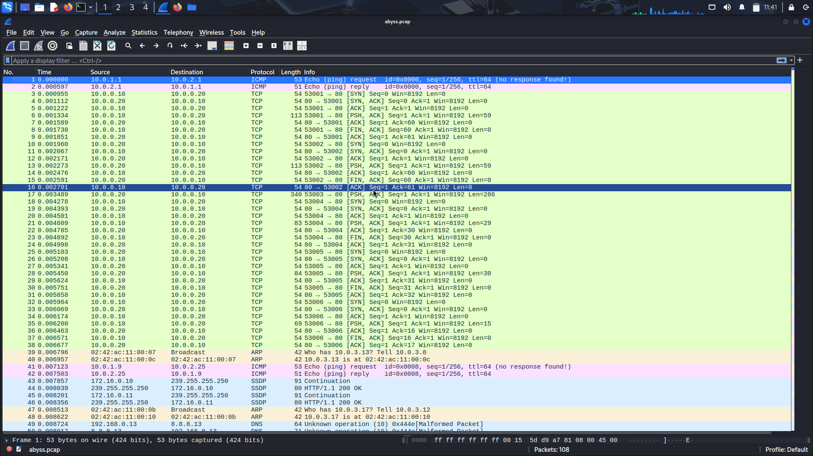
2. Upon going through the captured packets, I noticed a variety of protocols in use such as TCP,ICMP,etc and started scrolling through them.
3. I started to look all the packets one by one and at some packets, found some string mentioning Camus and Nietzsche.
4. During this, I found a string that appeared to be a password: `b3y0ndG00dand3vil` in one of the TCP packets and I was not sure that whether this was the Correct password or not and for what(I was just going through the hint provided).
   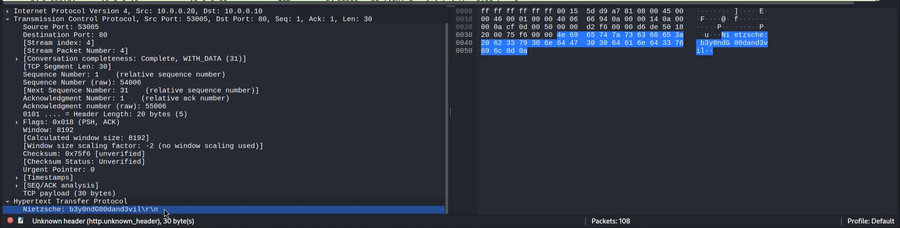
5. I also located a packet that indicated the presence of a RAR file, as the word "rar" was visible in the contents.
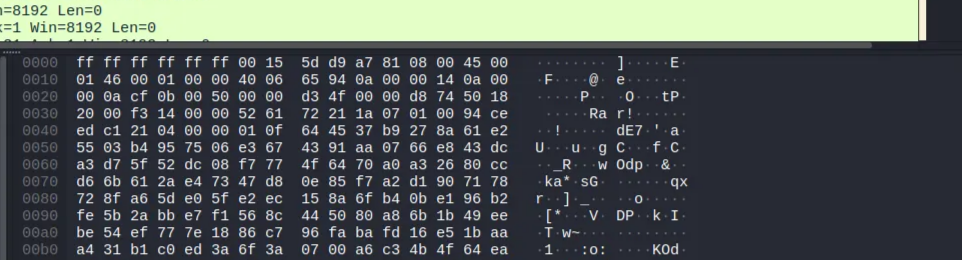
6. To extract the RAR file, I selected the relevant TCP packet containing the RAR data and followed it by clicking on `Follow > TCP Stream` and then saved the output as `output.rar` in my folder.
   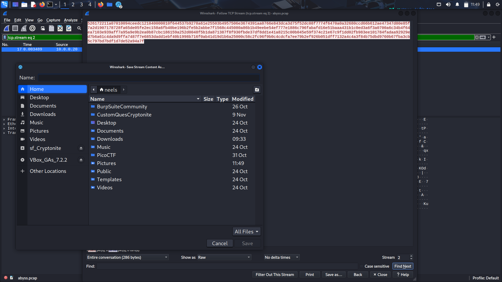
7. When I attempted to extract the contents of the RAR file, it prompted me for a password. I entered `b3y0ndG00dand3vil` as password.
   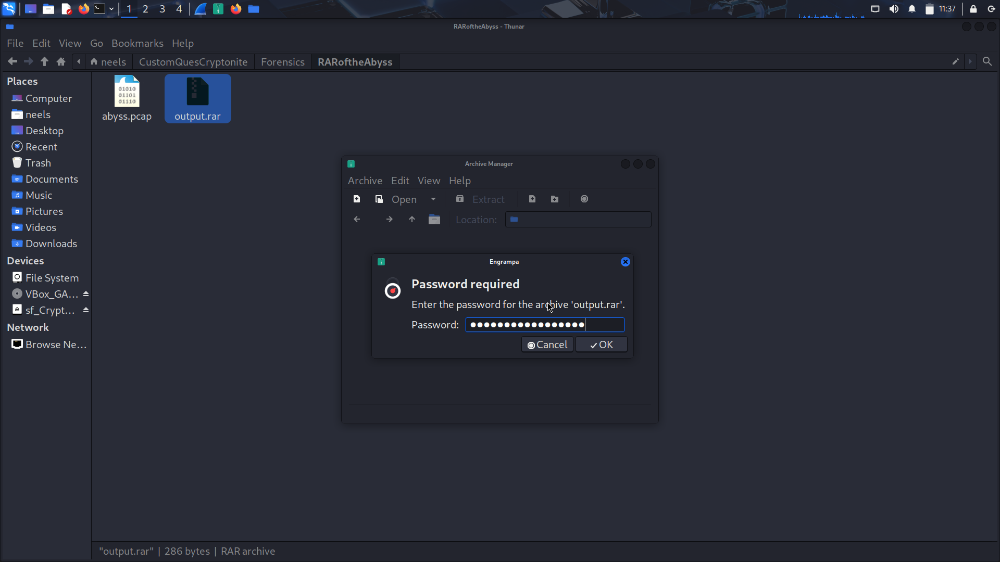
8. The extraction was successful, where a `flag.txt` file was there which contained the flag.
   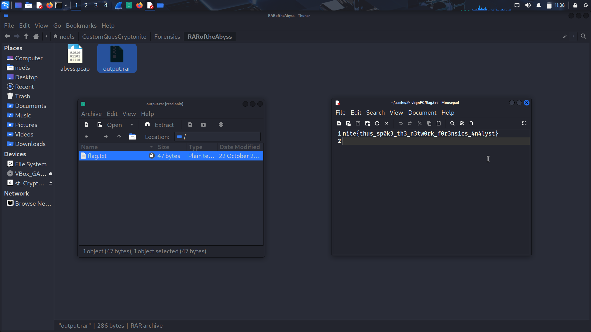

## Flag:
```
nite{thus_sp0k3_th3_n3tw0rk_f0r3ns1cs_4n4lyst}
```

## Concepts learnt:
- Extracting RAR files from TCP packets
- Analyzing packets to retrieve specific strings or data
- Understanding the usage of network forensics tools like Wireshark

## Notes:
- Initially, I had trouble finding the RAR file in the packet capture, which led me to consider other methods for viewing binary files which I looked in google and pages.
- I spent some time exploring different options in Wireshark before deciding to focus on identifying specific streams and strings.

## Resources:
- [Wireshark Tutorial Blog](https://www.varonis.com/blog/how-to-use-wireshark)


# 4. Nine Tails
The challenge has flag encrypted as passwords in firefox browser. The task is to locate specific files related to logins and encryption keys. It involves navigating through file directories to uncover credentials that may lead to the flag.

## Solution:
1. I started by extracting the provided RAR file which had an AD1 file which I first didnt understand what extension is this.
2. After some research I learned that this type of file can be examined using a program called `FTK Imager`. So I installed this app using its official site.
3. Upon opening the AD1 file I viewed several files but didnt understand at first of how to open it. I mounted the .ad1 file and tried to look using file browser but nothing was there in that. Then I looked for a video to get how to insert and read ISO file. I took a closer look at the challenge description and realized I was meant to search for passwords in the Firefox folder.
   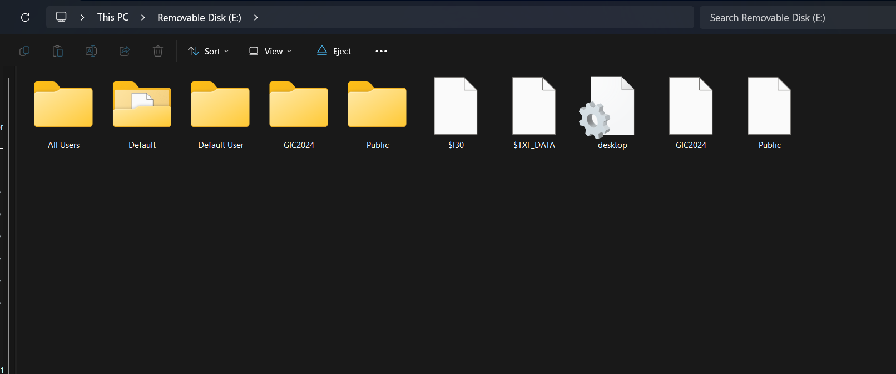
4. After many explorations, I Navigated to the AppData directory and I found the Mozilla folder containing Firefox, but my initial search under the user `j4gjesg4` yielded no passwords or useful files. So I tried more files to find for json or password files.
   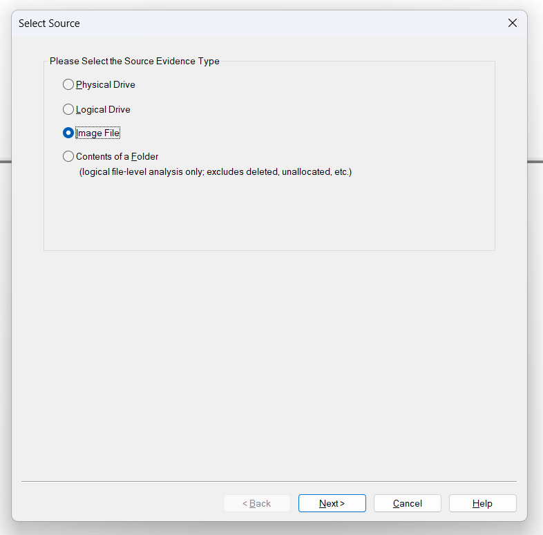
5. A further search led me to the Roaming directory where I accessed the database and JSON files containing the encrypted password information.
   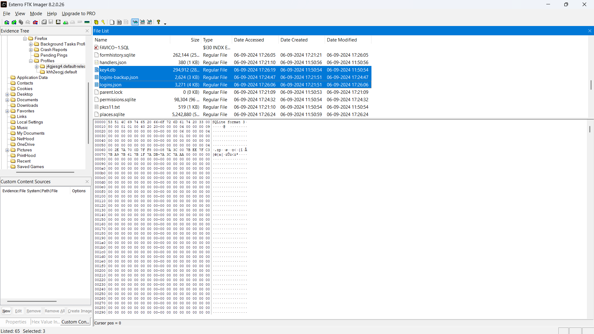
6. To decode the passwords I looked for a suitable tool and found `firepwd` after trying more tools, which is used for cracking passwords.
7. I installed the necessary Python packages for `firepwd` using the commands:
   ```bash
   ┌──(venv)─(neels㉿neel)-[~/CustomQuesCryptonite/Forensics/NineTails]
   └─$ pip install PyCryptodome

   ┌──(venv)─(neels㉿neel)-[~/CustomQuesCryptonite/Forensics/NineTails]
   └─$ pip install pyasn1
   ```
8. I ran `firepwd.py` with the database file:
   ```bash
   ┌──(venv)─(neels㉿neel)-[~/CustomQuesCryptonite/Forensics/NineTails]
   └─$ python firepwd.py -d .  

   globalSalt: b'b5dbfec66b891e193f516eccaf39209a93634332'
   SEQUENCE {
      SEQUENCE {
      OBJECTIDENTIFIER 1.2.840.113549.1.5.13 pkcs5 pbes2
      SEQUENCE {
         SEQUENCE {
            OBJECTIDENTIFIER 1.2.840.113549.1.5.12 pkcs5 PBKDF2
            SEQUENCE {
            OCTETSTRING b'eaa234484d176f2f091e1a9b2162b550a9874bf9ced92daa19c43e058b1328cf'
            INTEGER b'01'
            INTEGER b'20'
            SEQUENCE {
               OBJECTIDENTIFIER 1.2.840.113549.2.9 hmacWithSHA256
            }
            }
         }
         SEQUENCE {
            OBJECTIDENTIFIER 2.16.840.1.101.3.4.1.42 aes256-CBC
            OCTETSTRING b'c361eb13322fd6004ad463de0ef2'
         }
      }
      }
      OCTETSTRING b'c2cb6eb12879f4c649458e59d634f355'
   }
   clearText b'70617373776f72642d636865636b0202'
   password check? True
   SEQUENCE {
      SEQUENCE {
      OBJECTIDENTIFIER 1.2.840.113549.1.5.13 pkcs5 pbes2
      SEQUENCE {
         SEQUENCE {
            OBJECTIDENTIFIER 1.2.840.113549.1.5.12 pkcs5 PBKDF2
            SEQUENCE {
            OCTETSTRING b'ae2720e0964ce4beabedba40345712df4234f9ac9cd86e53a08982b65abbbd9c'
            INTEGER b'01'
            INTEGER b'20'
            SEQUENCE {
               OBJECTIDENTIFIER 1.2.840.113549.2.9 hmacWithSHA256
            }
            }
         }
         SEQUENCE {
            OBJECTIDENTIFIER 2.16.840.1.101.3.4.1.42 aes256-CBC
            OCTETSTRING b'e3f13fa968393e84117de43bee0e'
         }
      }
      }
      OCTETSTRING b'7810f052c04cd95b738f9df37a27fe297c3cc97d3a04ca7a71b89ba111f1dbbf'
   }
   clearText b'ab1ccd54c13b1573648a347a6e4c73dcc27af8cb8ad3c74c0808080808080808'
   decrypting login/password pairs
   https://www.rehack.xyz:b'warlocksmurf',b'GCTF{m0zarella'
   https://ctftime.org:b'ilovecheese',b'CHEEEEEEEEEEEEEEEEEEEEEEEEEESE'
   https://www.reddit.com:b'bluelobster',b'_f1ref0x_'
   https://www.facebook.com:b'flag',b'SIKE'
   https://warlocksmurf.github.io:b'Man I Love Forensics',b'p4ssw0rd}'
   ```
9. The tool processed the data and successfully returned the decrypted password pairs revealing the flag.

## Flag:
```
GCTF{m0zarella_f1ref0x_p4ssw0rd}
```

## Concepts learnt:
- How to extract files from an AD1 format using FTK Imager.
- Understanding the file structure of Firefox password storage including where passwords are located.
- Utilizing forensic tools like `firepwd` for decrypting Firefox-stored passwords.
- Importance of navigating different directories like AppData and Roaming to locate hidden files.

## Notes:
- Initially, I attempted to use `firefox_decrypt.py` which failed due to missing the profile location which I did not understand.
   ```bash
   ┌──(venv)─(neels㉿neel)-[~/CustomQuesCryptonite/Forensics/NineTails]
   └─$ python firefox_decrypt.py .
   2025-12-04 22:46:52,112 - WARNING - profile.ini not found in .
   2025-12-04 22:46:52,112 - WARNING - Continuing and assuming '.' is a profile location
   2025-12-04 22:46:52,113 - ERROR - Couldn't initialize NSS, maybe '.' is not a valid profile?
   ```

## Resources:
- Steps to load a file in FTK Imager: [YouTube Link](https://www.youtube.com/watch?v=CPup3ClC7nE)
- Firepwd repository: [GitHub - firepwd](https://github.com/lclevy/firepwd/tree/master)
- Information on Firefox password storage: [Super User Discussion](https://superuser.com/questions/267005/where-are-my-firefox-passwords-saved)


# 5. ReDraw
This challenge involves recovering data from a memory dump that was retrieved after a system crash during a drawing session. We have to look into command window that briefly appeared before the crash. We have to find three distinct flags each corresponding to different findings in the memory.

## Solution:
1. I began by downloading the provided RAR file and extracted its contents which gave `MemoryDump_Lab1.raw` file.
2. Following the hints in the challenge description, I recognized that I needed to use Volatility 2 for analysis which I searched on net to find its usecases and found that it is a Memory Forensic tool.
3. I downloaded the Linux version of Volatility from [GitHub](https://github.com/volatilityfoundation). I renamed the Volatility application to a simpler name, `vol` for easy use in CLI.
4. To get familiar with Volatility, I read over the [documentation](https://github.com/volatilityfoundation/volatility/wiki/Command-Reference) which was in there github repo itself to get an overview of its basic commands.
5. Still I was feeling confused about the commands which were there so many and I found an blog that offered better explanations on how to perform memory analysis.
6. I started my exploration by running `imageinfo` to get details about the memory dump(as mentioned by the youtube video while downloading Votality).
   ```bash
   ┌──(neels㉿neel)-[~/CustomQuesCryptonite/Forensics/ReDraw]
   └─$ ./vol -f MemoryDump_Lab1.raw imageinfo
   Volatility Foundation Volatility Framework 2.6
   INFO    : volatility.debug    : Determining profile based on KDBG search...
   Suggested Profile(s) : Win7SP1x64, Win7SP0x64, Win2008R2SP0x64, Win2008R2SP1x64_23418, Win2008R2SP1x64, Win7SP1x64_23418
   AS Layer1 : WindowsAMD64PagedMemory (Kernel AS)
   AS Layer2 : FileAddressSpace (/home/neels/CustomQuesCryptonite/Forensics/ReDraw/MemoryDump_Lab1.raw)
   PAE type : No PAE
   DTB : 0x187000L
   KDBG : 0xf800028100a0L
   Number of Processors : 1
   Image Type (Service Pack) : 1
   KPCR for CPU 0 : 0xfffff80002811d00L
   KUSER_SHARED_DATA : 0xfffff78000000000L
   Image date and time : 2019-12-11 14:38:00 UTC+0000
   Image local date and time : 2019-12-11 20:08:00 +0530
   ```
7. Based on the output I detected the appropriate profile to use(which was the first one) even I was not sure and I included `-profile=Win7SP1x64` in subsequent commands.

### Flag 1
8. I inferred from the challenge description that a command window was active before the crash, so I ran `pslist` to confirm running processes from the memory.
   ```bash
   ┌──(neels㉿neel)-[~/CustomQuesCryptonite/Forensics/ReDraw]
   └─$ ./vol -f MemoryDump_Lab1.raw --profile=Win7SP1x64 pslist
   Volatility Foundation Volatility Framework 2.6
   Offset(V)          Name                    PID   PPID   Thds     Hnds   Sess  Wow64 Start                          Exit

   ---

   0xfffffa8000ca0040 System                    4      0     80      570 ------      0 2019-12-11 13:41:25 UTC+0000

   0xfffffa800148f040 smss.exe                248      4      3       37 ------      0 2019-12-11 13:41:25 UTC+0000

   0xfffffa800154f740 csrss.exe               320    312      9      457      0      0 2019-12-11 13:41:32 UTC+0000

   0xfffffa8000ca81e0 csrss.exe               368    360      7      199      1      0 2019-12-11 13:41:33 UTC+0000

   0xfffffa8001c45060 psxss.exe               376    248     18      786      0      0 2019-12-11 13:41:33 UTC+0000

   0xfffffa8001c5f060 winlogon.exe            416    360      4      118      1      0 2019-12-11 13:41:34 UTC+0000

   0xfffffa8001c5f630 wininit.exe             424    312      3       75      0      0 2019-12-11 13:41:34 UTC+0000

   0xfffffa8001c98530 services.exe            484    424     13      219      0      0 2019-12-11 13:41:35 UTC+0000

   0xfffffa8001ca0580 lsass.exe               492    424      9      764      0      0 2019-12-11 13:41:35 UTC+0000

   0xfffffa8001ca4b30 lsm.exe                 500    424     11      185      0      0 2019-12-11 13:41:35 UTC+0000

   0xfffffa8001cf4b30 svchost.exe             588    484     11      358      0      0 2019-12-11 13:41:39 UTC+0000

   0xfffffa8001d327c0 VBoxService.ex          652    484     13      137      0      0 2019-12-11 13:41:40 UTC+0000

   0xfffffa8001d49b30 svchost.exe             720    484      8      279      0      0 2019-12-11 13:41:41 UTC+0000

   0xfffffa8001d8c420 svchost.exe             816    484     23      569      0      0 2019-12-11 13:41:42 UTC+0000

   0xfffffa8001da5b30 svchost.exe             852    484     28      542      0      0 2019-12-11 13:41:43 UTC+0000

   0xfffffa8001da96c0 svchost.exe             876    484     32      941      0      0 2019-12-11 13:41:43 UTC+0000

   0xfffffa8001e1bb30 svchost.exe             472    484     19      476      0      0 2019-12-11 13:41:47 UTC+0000

   0xfffffa8001e50b30 svchost.exe            1044    484     14      366      0      0 2019-12-11 13:41:48 UTC+0000

   0xfffffa8001eba230 spoolsv.exe            1208    484     13      282      0      0 2019-12-11 13:41:51 UTC+0000

   0xfffffa8001eda060 svchost.exe            1248    484     19      313      0      0 2019-12-11 13:41:52 UTC+0000

   0xfffffa8001f58890 svchost.exe            1372    484     22      295      0      0 2019-12-11 13:41:54 UTC+0000

   0xfffffa8001f91b30 TCPSVCS.EXE            1416    484      4       97      0      0 2019-12-11 13:41:55 UTC+0000

   0xfffffa8000d3c400 sppsvc.exe             1508    484      4      141      0      0 2019-12-11 14:16:06 UTC+0000

   0xfffffa8001c38580 svchost.exe             948    484     13      322      0      0 2019-12-11 14:16:07 UTC+0000

   0xfffffa8002170630 wmpnetwk.exe           1856    484     16      451      0      0 2019-12-11 14:16:08 UTC+0000

   0xfffffa8001d376f0 SearchIndexer.          480    484     14      701      0      0 2019-12-11 14:16:09 UTC+0000

   0xfffffa8001eb47f0 taskhost.exe            296    484      8      151      1      0 2019-12-11 14:32:24 UTC+0000

   0xfffffa8001dfa910 dwm.exe                1988    852      5       72      1      0 2019-12-11 14:32:25 UTC+0000

   0xfffffa8002046960 explorer.exe            604   2016     33      927      1      0 2019-12-11 14:32:25 UTC+0000

   0xfffffa80021c75d0 VBoxTray.exe           1844    604     11      140      1      0 2019-12-11 14:32:35 UTC+0000

   0xfffffa80021da060 audiodg.exe            2064    816      6      131      0      0 2019-12-11 14:32:37 UTC+0000

   0xfffffa80022199e0 svchost.exe            2368    484      9      365      0      0 2019-12-11 14:32:51 UTC+0000

   0xfffffa8002222780 cmd.exe                1984    604      1       21      1      0 2019-12-11 14:34:54 UTC+0000

   0xfffffa8002227140 conhost.exe            2692    368      2       50      1      0 2019-12-11 14:34:54 UTC+0000

   0xfffffa80022bab30 mspaint.exe            2424    604      6      128      1      0 2019-12-11 14:35:14 UTC+0000

   0xfffffa8000eac770 svchost.exe            2660    484      6      100      0      0 2019-12-11 14:35:14 UTC+0000

   0xfffffa8001e68060 csrss.exe              2760   2680      7      172      2      0 2019-12-11 14:37:05 UTC+0000

   0xfffffa8000ecbb30 winlogon.exe           2808   2680      4      119      2      0 2019-12-11 14:37:05 UTC+0000

   0xfffffa8000f3aab0 taskhost.exe           2908    484      9      158      2      0 2019-12-11 14:37:13 UTC+0000

   0xfffffa8000f4db30 dwm.exe                3004    852      5       72      2      0 2019-12-11 14:37:14 UTC+0000

   0xfffffa8000f4c670 explorer.exe           2504   3000     34      825      2      0 2019-12-11 14:37:14 UTC+0000

   0xfffffa8000f9a4e0 VBoxTray.exe           2304   2504     14      144      2      0 2019-12-11 14:37:14 UTC+0000

   0xfffffa8000fff630 SearchProtocol         2524    480      7      226      2      0 2019-12-11 14:37:21 UTC+0000

   0xfffffa8000ecea60 SearchFilterHo         1720    480      5       90      0      0 2019-12-11 14:37:21 UTC+0000

   0xfffffa8001010b30 WinRAR.exe             1512   2504      6      207      2      0 2019-12-11 14:37:23 UTC+0000

   0xfffffa8001020b30 SearchProtocol         2868    480      8      279      0      0 2019-12-11 14:37:23 UTC+0000

   0xfffffa8001048060 DumpIt.exe              796    604      2       45      1      1 2019-12-11 14:37:54 UTC+0000

   0xfffffa800104a780 conhost.exe            2260    368      2       50      1      0 2019-12-11 14:37:54 UTC+0000
   ```
9. I noticed the presence of `cmd.exe` which in description of the challenge mentioned of some command-line activity.
10. To retrieve the command history I executed the `consoles` command.
   ```bash
   ┌──(neels㉿neel)-[~/CustomQuesCryptonite/Forensics/ReDraw]
   └─$ ./vol -f MemoryDump_Lab1.raw --profile=Win7SP1x64 consoles
   Volatility Foundation Volatility Framework 2.6
   **************************************************
   ConsoleProcess: conhost.exe Pid: 2692
   Console: 0xff756200 CommandHistorySize: 50
   HistoryBufferCount: 1 HistoryBufferMax: 4
   OriginalTitle: %SystemRoot%\system32\cmd.exe
   Title: C:\Windows\system32\cmd.exe - St4G3$1
   AttachedProcess: cmd.exe Pid: 1984 Handle: 0x60
   ----
   CommandHistory: 0x1fe9c0 Application: cmd.exe Flags: Allocated, Reset
   CommandCount: 1 LastAdded: 0 LastDisplayed: 0
   FirstCommand: 0 CommandCountMax: 50
   ProcessHandle: 0x60
   ----
   Cmd #0 at 0x1de3c0: St4G3$1
   ----
   Screen 0x1e0f70 X:80 Y:300
   Dump:
   Microsoft Windows [Version 6.1.7601]
   Copyright (c) 2009 Microsoft Corporation.  All rights reserved.
   C:\Users\SmartNet>St4G3$1                           ZmxhZ3t0aDFzXzFzX3RoM18xc3Rfc3Q0ZzMhIX0=            Press any key to continue . . .
   **************************************************
   ConsoleProcess: conhost.exe Pid: 2260
   Console: 0xff756200 CommandHistorySize: 50
   HistoryBufferCount: 1 HistoryBufferMax: 4
   OriginalTitle: C:\Users\SmartNet\Downloads\DumpIt\DumpIt.exe
   Title: C:\Users\SmartNet\Downloads\DumpIt\DumpIt.exe
   AttachedProcess: DumpIt.exe Pid: 796 Handle: 0x60
   ----
   CommandHistory: 0x38ea90 Application: DumpIt.exe Flags: Allocated
   CommandCount: 0 LastAdded: -1 LastDisplayed: -1
   FirstCommand: 0 CommandCountMax: 50
   ProcessHandle: 0x60
   ----
   Screen 0x371050 X:80 Y:300
   Dump:
   DumpIt - v1.3.2.20110401 - One click memory memory dumper
   Copyright (c) 2007 - 2011, Matthieu Suiche <http://www.msuiche.net>
   Copyright (c) 2010 - 2011, MoonSols <http://www.moonsols.com>
   Address space size:        1073676288 bytes (   1023 Mb)
   Free space size:          24185389056 bytes (  23064 Mb)
   * Destination = \??\C:\Users\SmartNet\Downloads\DumpIt\SMARTNET-PC-20191211-
   --> Are you sure you want to continue? [y/n] y
   + Processing...
   ```
11. The output contained a base64 encoded command: `ZmxhZ3t0aDFzXzFzX3RoM18xc3Rfc3Q0ZzMhIX0=`.
12. I decoded this base64 string to retrieve the first flag: 
    ```
    flag{th1s_1s_th3_1st_st4g3!!}
    ```

### Flag 2
13. The challenge hinted of a painting program confirming with the presence of `mspaint.exe` in the running processes(which I found after reading process list many times).
14. I located an article discussing how to extract images from memory dump.
15. I used `memdump` to create a dump of the `mspaint.exe` process with PID 2424.
   ```bash
   ┌──(neels㉿neel)-[~/CustomQuesCryptonite/Forensics/ReDraw]
   └─$ ./vol -f MemoryDump_Lab1.raw --profile=Win7SP1x64 memdump -p 2424 -D .
   Volatility Foundation Volatility Framework 2.6
   Writing mspaint.exe [  2424] to 2424.dmp
   ```
16. I renamed the resulting file `2424.dmp` to `2424.data` and attempted to open it in GIMP as raw data(Also confirmed with my Mentor).
   ```bash
   ──(neels㉿neel)-[~/CustomQuesCryptonite/Forensics/ReDraw]
   └─$ chmod +x GIMP-3.0.6-x86_64.AppImage

   ┌──(neels㉿neel)-[~/CustomQuesCryptonite/Forensics/ReDraw]
   └─$ ./GIMP-3.0.6-x86_64.AppImage

   set device 'ImExPS/2 Generic Explorer Mouse' to mode: disabled
   set device 'Virtual core XTEST pointer' to mode: disabled
   set device 'VirtualBox USB Tablet' to mode: disabled
   set device 'VirtualBox mouse integration' to mode: disabled
   ```
   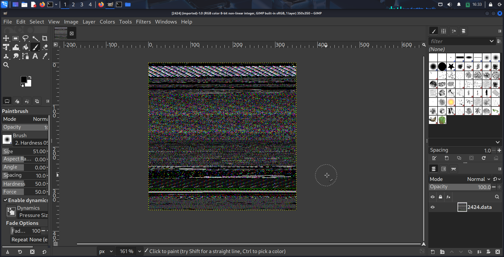
17. Despite numerous adjustments with dimensions, I initially saw nothing. But suddenly I was able to reach the point where something written starts to appear. Then after some more adjustments I got some exact values where text which was the flag was visible.
   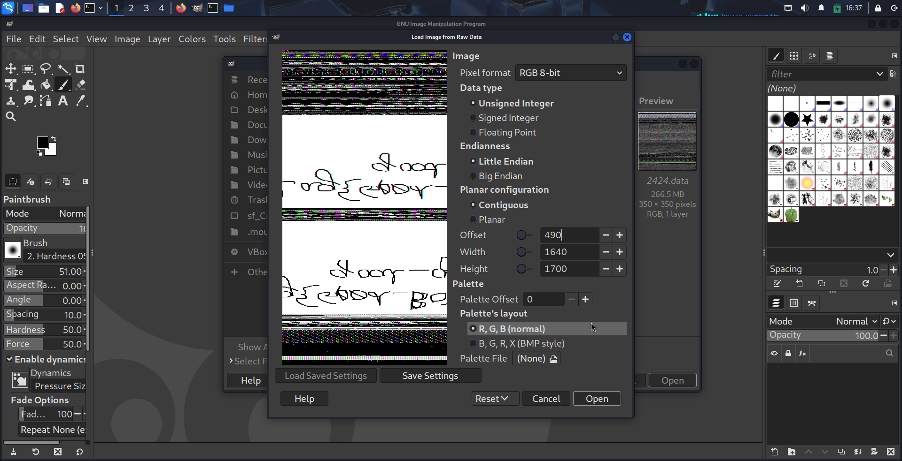
18. Then I flipped the image vertically in GIMP using `View > Flip and Rotate > Rotate` Vertically revealing part of the flag.  
   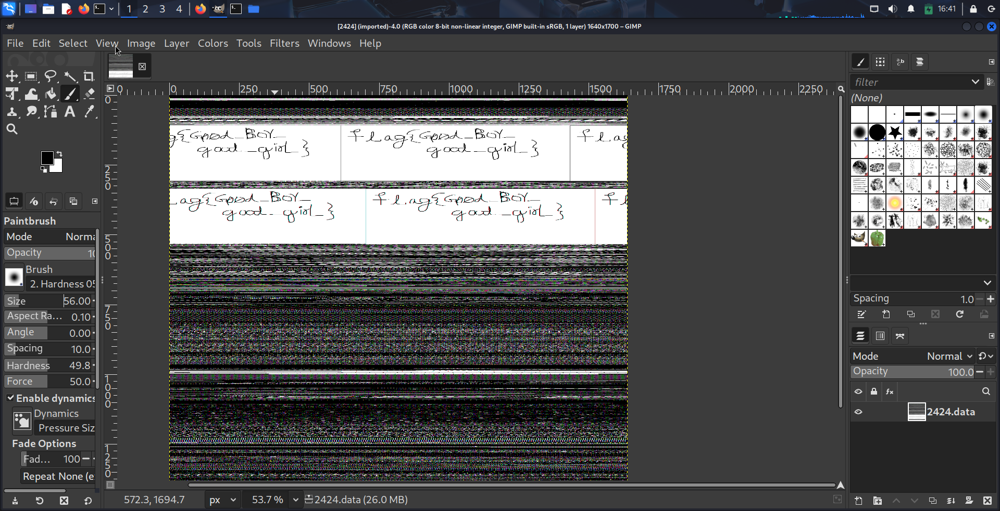
   `flag{G00d_BoY_good_girL}`

### Flag 3
19. To find the `mysterious archive` mentioned in the challenge description, I executed a `filescan` to list files in memory.
   ```bash
   ┌──(neels㉿neel)-[~/CustomQuesCryptonite/Forensics/ReDraw]
   └─$ ./vol -f MemoryDump_Lab1.raw --profile=Win7SP1x64 filescan

   Volatility Foundation Volatility Framework 2.6
   Offset(P)            #Ptr   #Hnd Access Name

   0x000000003e801310      2      1 \Device\NamedPipe\MsFteWds
   0x000000003e809610      9      0 R--r-d \Device\HarddiskVolume2\Windows\System32\dot3api.dll
   0x000000003e80b9f0      2      1  \Device\Afd\Endpoint
   ```
20. There were a lot of files but I checked for some images and other file format and then I used `grep` to search for pngs,jpegs and rar, but I found something in rar. I then filtered the results for `.rar` files using grep.
   ```bash
   ┌──(neels㉿neel)-[~/CustomQuesCryptonite/Forensics/ReDraw]
   └─$ ./vol -f MemoryDump_Lab1.raw --profile=Win7SP1x64 filescan | grep -E '\.rar'
   Volatility Foundation Volatility Framework 2.6
   0x000000003fa3ebc0      1      0 R--r-- \Device\HarddiskVolume2\Users\Alissa Simpson\Documents\Important.rar
   0x000000003fac3bc0      1      0 R--r-- \Device\HarddiskVolume2\Users\Alissa Simpson\Documents\Important.rar
   0x000000003fb48bc0      1      0 R--r-- \Device\HarddiskVolume2\Users\Alissa Simpson\Documents\Important.rar
   ```
21. With the offsets identified which is `0x000000003fa3ebc0`, I used the `dumpfiles` command to extract the important RAR file.
   ```bash
   ┌──(neels㉿neel)-[~/CustomQuesCryptonite/Forensics/ReDraw]
   └─$ ./vol -f MemoryDump_Lab1.raw --profile=Win7SP1x64 dumpfiles -Q 0x000000003fa3ebc0 -D .
   Volatility Foundation Volatility Framework 2.6
   DataSectionObject 0x3fa3ebc0   None   \Device\HarddiskVolume2\Users\Alissa Simpson\Documents\Important.rar
   ```
22. I renamed the output `.dat` file to a `.rar` file and attempted to extract its contents.
23. The RAR archive was password protected which indicated as the NTLM hash of Alissa's account password.
   ```bash
   ┌──(neels㉿neel)-[~/CustomQuesCryptonite/Forensics/ReDraw]
   └─$ unrar e file.None.0xfffffa8001034450.rar

   UNRAR 7.11 freeware      Copyright (c) 1993-2025 Alexander Roshal

   Archive comment:
   Password is NTLM hash(in uppercase) of Alissa's account passwd.

   Extracting from file.None.0xfffffa8001034450.rar

   Enter password (will not be echoed) for flag3.png:
   ```
24. To discover the password I again ran `hashdump` to extract user account hashes.
   ```bash
   ┌──(neels㉿neel)-[~/CustomQuesCryptonite/Forensics/ReDraw]
   └─$ ./vol -f MemoryDump_Lab1.raw --profile=Win7SP1x64 hashdump

   Volatility Foundation Volatility Framework 2.6
   Administrator:500:aad3b435b51404eeaad3b435b51404ee:31d6cfe0d16ae931b73c59d7e0c089c0:::
   Guest:501:aad3b435b51404eeaad3b435b51404ee:31d6cfe0d16ae931b73c59d7e0c089c0:::
   SmartNet:1001:aad3b435b51404eeaad3b435b51404ee:4943abb39473a6f32c11301f4987e7e0:::
   HomeGroupUser$:1002:aad3b435b51404eeaad3b435b51404ee:f0fc3d257814e08fea06e63c5762ebd5:::
   Alissa Simpson:1003:aad3b435b51404eeaad3b435b51404ee:f4ff64c8baac57d22f22edc681055ba6:::
   ```
25. The hash for Alissa's account led me to the password: `F4FF64C8BAAC57D22F22EDC681055BA6`(which I tried in lowercase earlier but the password was in UPPERCASE).
26. After entering this password, I successfully extracted the third flag.  
   `flag{w3ll_3rd_stage_was_easy}`
   


## Flags:
```
flag{th1s_1s_th3_1st_st4g3!!}
flag{G00d_BoY_good_girL}
flag{w3ll_3rd_stage_was_easy}
```

## Concepts learnt:
- I gained experience in using Volatility which is used for memory forensics.
- I learned how to analyze memory dumps to extract sensitive information from a users computer memory.
- I discovered how to retrieve run commands and command history from a memory dump.
- I identified how to recover images from a memory dump using tools like `GIMP`.
- I became familiar with NTLM hashing and its application in password recovery(which I used to get flag 3).

## Notes:
- I spent a lot of time manipulating offsets in GIMP to view the image correctly.
- I explored other `.rar` archives in the memory dump out of curiosity, which I later realized all had the same password requirement.

## Resources:
- Installing Volatility: [YouTube video](https://www.youtube.com/watch?v=0cS8LhFZChQ)
- Volatility Linux file: [Download Link](https://github.com/volatilityfoundation/volatility/releases/download/2.6.1/volatility_2.6_lin64_standalone.zip)
- Volatility commands help article: [Blog](https://www.varonis.com/blog/how-to-use-volatility)
- GIMP download: [GIMP Official Site](https://www.gimp.org/downloads/)