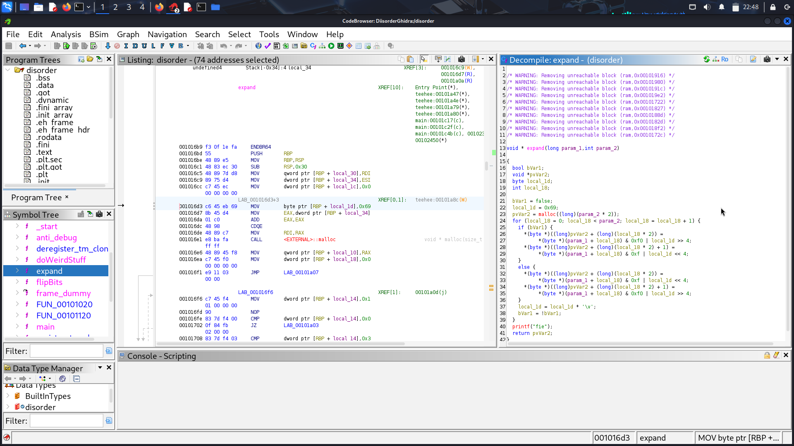
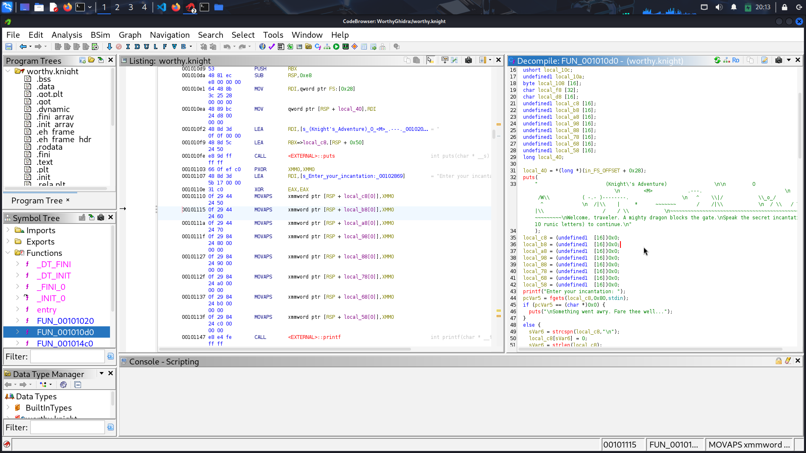
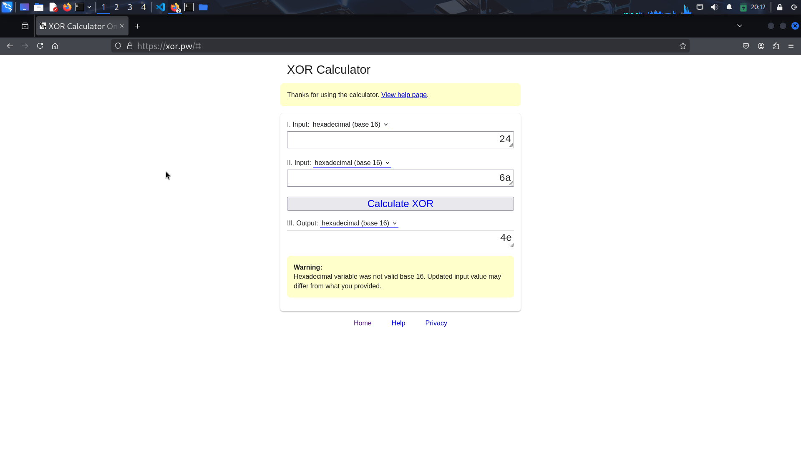
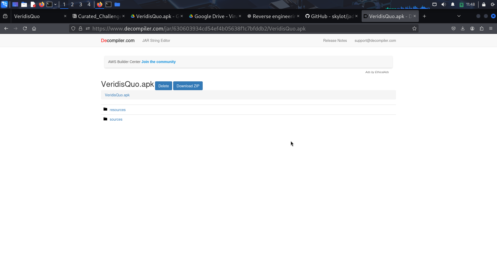
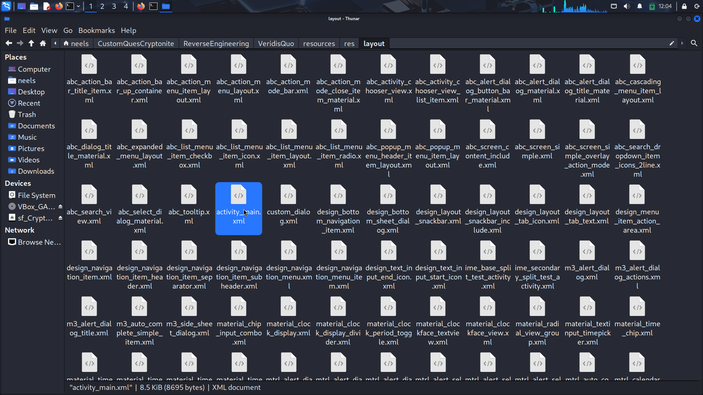
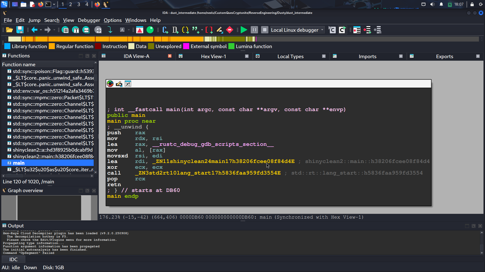

# 1. JoyDivision
The challenge involves reversing a binary applicationand to understand how the binary reads the input file and processes it through various functions. The goal is to reverse the transformations to recover the original content of the file, looking for the flag contained.

## Solution:
1. First I ran the program to see what it does.
    ```bash
    ┌──(neels㉿neel)-[~/CustomQuesCryptonite/ReverseEngineering/JoyDivision]
    └─$ ./disorder 

    May Jupiter strike you down Caeser before you seize the treasury!! You will have to tear me apart
    for me to tell you the flag to unlock the Roman Treasury and fund your civil war. I, Lucius Caecilius
    Metellus, shall not let you pass until you get this password right. (or threaten to kill me-)

    zsh: segmentation fault  ./disorder
    ```
    I started by analyzing the binary using Ghidra as used in other challenges, examining how it reads the content from the file named `palatinepackflag.txt` using the `fgets` function. This indicated that the actual file exist in palatinepackflag.txt which after certain operations are stored in given `flag.txt` file.

2. I identified two functions: `flipBits` and `expand`. The `flipBits` function alternates between flipping bits and XOR operations with a changing key. This suggests that reversing this function is simply performing the same operations again(Property of XOR) will restore the original data.
    

3. My first target was the initial reading and flipping using `flipBits`. The method applied a bitwise NOT for even positions and XORed with a key (starting at `0x69` and incremented by `0x20`) for odd positions. To reverse this process I applied the same operations to the transformed data.

4. The binary then calls the `expand` function three times. Each expansion doubles the data size by splitting bytes using some operations and modifying a key multiplied by 11.

5. Then, I examined the transformations of the expand function and tried to build logic for that where the main time wasted.

6. Each expansion was reversed by compressing the expanded bytes, followed by a execution of `flipBits` to restore the original file content.

7. Finally, I developed a Python script that executed these reversal steps in reverse order and after several corrections and changes I got the flag.

    ```python
    from pathlib import Path
    import re

    data = Path("flag.txt").read_bytes()

    def inverse_expand(b):
        n = len(b) // 2
        out = bytearray(n)
        k = 0x69
        s = False
        for i in range(n):
            a = b[2*i]
            c = b[2*i+1]
            if not s:
                v = (a & 0x0F) | (c & 0xF0)
            else:
                v = (c & 0x0F) | (a & 0xF0)
            out[i] = v
            k = (k * 11) & 0xFF
            s = not s
        return bytes(out)

    def flip_bits(b):
        out = bytearray(b)
        k = 0x69
        s = False
        for i in range(len(out)):
            if s:
                out[i] ^= k
                k = (k + 0x20) & 0xFF
            else:
                out[i] = (~out[i]) & 0xFF
            s = not s
        return bytes(out)

    a = inverse_expand(data)
    a = inverse_expand(a)
    a = inverse_expand(a)

    if a and a[-1] == 0:
        a = a[:-1]

    r = flip_bits(a)

    try:
        t = r.decode()
    except:
        t = ''.join(chr(x) if 32 <= x <= 126 else ' ' for x in r)

    print(t)

    for p in [r'CTF\{[^}]+\}', r'flag\{[^}]+\}', r'FLAG\{[^}]+\}', r'picoCTF\{[^}]+\}']:
        m = re.search(p, t)
        if m:
            print(m.group(0))
    ```

After executing the script with `flag.txt`, the output revealed readable text.
    ```bash
    ┌──(neels㉿neel)-[~/CustomQuesCryptonite/ReverseEngineering/JoyDivision]
    └─$ python solve.py                                    
    sunshine{C3A5ER_CR055ED_TH3_RUB1C0N}
    ```

## Flag:
```
sunshine{C3A5ER_CR055ED_TH3_RUB1C0N}
```

## Concepts learnt:
- Understanding of binary analysis and reversing using Ghidra.
- Got to know how to reverse transformations performed on data that is bit manipulation.
- Familiarity with bitwise operations: NOT and XOR.

## Notes:
- Initially, I did not understand why flag.txt file is given, but after understanding the code I got that it is just cipher of the original flag.
- I was not able to decode or reverse what the expand function is doing, but after several steps was able to do it.

## Resources:
- Ghidra official documentation for binary analysis.
- Some google searches.


# 2. WorthyKnight
This challenge involves reverse engineering a binary file named `worthy.knight`. The challenge requires us to determine the exact input that the binary expects. We have to decompile the code to get the working of the program to get our flag.

## Solution:
1. I started by changing the permissions of the `worthy.knight` file to make it executable using the command:
   ```bash
   chmod +x worthy.knight
   ```
2. After that, I executed the binary with:
    ```bash
    ┌──(neels㉿neel)-[~/CustomQuesCryptonite/ReverseEngineering/WorthyKnight]
    └─$ ./worthy.knight
    (Knight's Adventure)
         O
    <M>            .---.
    /W\\           ( -.- )--------.
    ^    \|/            \*o*/         )    ^

    /|\    |     *      ~~~~~~~       /    /|\

    / \   / \  /|\                    /    / \
    Welcome, traveler. A mighty dragon blocks the gate.
    Speak the secret incantation (10 runic letters) to continue.

    Enter your incantation: AAAAAAAAAA

    The ancient seals do not resonate with your runes.
    The ancient dragon roars: "Begone, unworthy!"
            __,---/￣￣＼
            __/義___/  ●  ●  \\___
            |  浪人|      ､_J      |
            \\___,  \\___,____, ___/
                    /     |     \\
                (      |      )
                    \\     |     /
3. The output displayed an ASCII art representation of a knight and asked for a 10-character incantation.
4. I entered `AAAAAAAAAA` as a test input, and the response indicated that it was incorrect.
5. I loaded the `worthy.knight` binary into Ghidra for analysis and created a new project.
    
6. I inspected the functions and identified `FUN_001010d0` as the main function because it involved user input and output.
7. Inside the `FUN_001010d0`, I found a set of conditions that validated the user input grouped into pairs. This indicated that the 10-character input could be analyzed as five separate pairs.
8. For the first pair - the checks indicated that:
   ```c
   (local_c8[1] ^ local_c8[0]) == 0x24
   local_c8[1] == 0x6a
   ```
   This led me to calculate that the second character must be `j`, and I calculated the first character using XOR resulting in `N`. Thus Pair-1 resolved to `Nj`.
   
9. Next, I examined Pair-3 which involved an MD5 hash check. The input characters were swapped before hashing:
   ```c
   MD5([b][a])
   ```
   I was unable to reverse MD5 manually, so I created a brute-force script to test all combinations until I found a match for the target hash:
   ```python
    import hashlib

    target_hash = '33a3192ba92b5a4803c9a9ed70ea5a9c'

    def check_hash(a, b):
        return hashlib.md5(bytes([a, b])).hexdigest() == target_hash

    for a in range(ord('A'), ord('Z') + 1):
        for b in range(ord('Z') + 1):
            if check_hash(a, b):
                print(f"{chr(a)}{chr(b)}")
                break
        else:
            continue
        break

    for a in range(ord('a'), ord('z') + 1):
        for b in range(ord('a'), ord('z') + 1):
            if check_hash(a, b):
                print(f"{chr(a)}{chr(b)}")
                break
        else:
            continue
        break

    for a in range(ord('A'), ord('Z') + 1):
        for b in range(ord('a'), ord('z') + 1):
            if check_hash(a, b):
                print(f"{chr(a)}{chr(b)}")
                break
        else:
            continue
        break
   ```
10. The script revealed that the correct input was `Tf` for the swapped order that means Pair-3 was `fT`.
    ```bash
    ┌──(neels㉿neel)-[~/CustomQuesCryptonite/ReverseEngineering/WorthyKnight]
    └─$ python pair3.py
    Tf
    ```
11. I solved Pair-2, Pair-4, and Pair-5 using similar XOR method using a Xor calculation tool, resulting in:
    - Pair-2: `kS`
    - Pair-4: `Ya`
    - Pair-5: `Ii`
12. Concatenating all pairs gave me the full, correct incantation:
    ``` 
    NjkSfTYaIi 
    ```
13. Finally, I saw the code that the flag was wrapped in `KCTF{}` giving me the full flag.

## Flag:
```
KCTF{NjkSfTYaIi}
```

## Concepts learnt:
- Basics of binary analysis using Ghidra
- Understanding of how to manipulate and analyze user input in binaries
- XOR operations and their applications in deriving character values
- Understanding of cryptographic hashes (MD5)

## Notes:
- While analyzing, I mistakenly thought I could derive a fixed pattern for all pairs, but it turned out that each was unique in logic.
- Initially, I thought that to decipher the MD5 hash there can be some algorithms, but realised that brute-forcing was only option for me.

## Resources:
- XOR calculations online tool: [xor.pw](https://xor.pw/#)
- Ghidra installation guide: [Kali Ghidra](https://www.kali.org/tools/ghidra/)


# 3. Time
This challenge presents a number guessing game where the player must guess a randomly generated number to reveal a flag. The challenge need us to reverse engineering the executable file to obtain the required number without guessing blindly.

## Solution:
1. I began by changing the file permissions of the `time` executable program to make it runnable using `chmod +x time`.
2. I executed the program with `./time`, which led me to guess a number.
    ```bash
    ┌──(neels㉿neel)-[~/CustomQuesCryptonite/ReverseEngineering/Time]
    └─$ ./time

    Welcome to the number guessing game!
    I'm thinking of a number. Can you guess it?
    Guess right and you get a flag!
    Enter your number: 3423424
    Your guess was 3423424.
    Looking for 2000268884.
    Sorry. Try again, wrong guess!
    ```
3. So we have to guess the correct number to get our flag(success message).
4. I decided to use `gdb` for reverse engineering as I had used in previous CTFs. I opened the terminal and typed `gdb time` to initiate debugging.
    ```bash
    ┌──(neels㉿neel)-[~/CustomQuesCryptonite/ReverseEngineering/Time]
    └─$ gdb time
    GNU gdb (Debian 16.3-5) 16.3
    Copyright (C) 2024 Free Software Foundation, Inc.
    License GPLv3+: GNU GPL version 3 or later http://gnu.org/licenses/gpl.html
    This is free software: you are free to change and redistribute it.
    There is NO WARRANTY, to the extent permitted by law.
    Type "show copying" and "show warranty" for details.
    This GDB was configured as "x86_64-linux-gnu".
    Type "show configuration" for configuration details.
    For bug reporting instructions, please see:
    https://www.gnu.org/software/gdb/bugs/.
    Find the GDB manual and other documentation resources online at:
    http://www.gnu.org/software/gdb/documentation/.

    For help, type "help".
    Type "apropos word" to search for commands related to "word"...
    Reading symbols from time...
    (No debugging symbols found in time)
    (gdb)
    ```
5. In `gdb` I checked for available functions using the command `info functions` to understand what functions were used in the program.
    
    ```bash
    (gdb) info functions
    All defined functions:

    Non-debugging symbols:
    0x00000000004006b8  _init
    0x00000000004006e0  puts@plt
    0x00000000004006f0  fclose@plt
    0x0000000000400700  __stack_chk_fail@plt
    0x0000000000400710  printf@plt
    0x0000000000400720  memset@plt
    0x0000000000400730  srand@plt
    0x0000000000400740  fgets@plt
    0x0000000000400750  time@plt
    0x0000000000400760  fflush@plt
    0x0000000000400770  fopen@plt
    0x0000000000400780  __isoc99_scanf@plt
    0x0000000000400790  rand@plt
    0x00000000004007a0  _start
    0x00000000004007d0  deregister_tm_clones
    0x0000000000400800  register_tm_clones
    0x0000000000400840  __do_global_dtors_aux
    0x0000000000400870  frame_dummy
    0x0000000000400877  giveFlag
    0x000000000040092b  main
    0x0000000000400a50  __libc_csu_init
    ```
6. I assumed that the functions `srand@plt` and `rand@plt` were responsible for generating the random number, so I needed to find where the random number was stored like in which register.
7. So to get where the number was stored, I disassembled the `main` function using the command `disassemble main`.
    ```bash
    (gdb) disassemble main
    Dump of assembler code for function main:
    0x000000000040092b <+0>:     push   %rbp
    0x000000000040092c <+1>:     mov    %rsp,%rbp
    0x000000000040092f <+4>:     sub    $0x20,%rsp
    0x0000000000400933 <+8>:     mov    %edi,-0x14(%rbp)
    0x0000000000400936 <+11>:    mov    %rsi,-0x20(%rbp)
    0x000000000040093a <+15>:    mov    %fs:0x28,%rax
    0x0000000000400943 <+24>:    mov    %rax,-0x8(%rbp)
    0x0000000000400947 <+28>:    xor    %eax,%eax
    0x0000000000400949 <+30>:    mov    $0x0,%edi
    0x000000000040094e <+35>:    call   0x400750 time@plt
    0x0000000000400953 <+40>:    mov    %eax,%edi
    0x0000000000400955 <+42>:    call   0x400730 srand@plt
    0x000000000040095a <+47>:    call   0x400790 rand@plt
    0x000000000040095f <+52>:    mov    %eax,-0xc(%rbp)
    0x0000000000400962 <+55>:    lea    0x1c7(%rip),%rdi        # 0x400b30
    0x0000000000400969 <+62>:    call   0x4006e0 puts@plt
    0x000000000040096e <+67>:    lea    0x1e3(%rip),%rdi        # 0x400b58
    0x0000000000400975 <+74>:    call   0x4006e0 puts@plt
    0x000000000040097a <+79>:    lea    0x207(%rip),%rdi        # 0x400b88
    0x0000000000400981 <+86>:    call   0x4006e0 puts@plt
    0x0000000000400986 <+91>:    lea    0x21b(%rip),%rdi        # 0x400ba8
    0x000000000040098d <+98>:    mov    $0x0,%eax
    0x0000000000400992 <+103>:   call   0x400710 printf@plt
    ```
8. While examining the assembly code, I located the instruction `mov %eax,-0xc(%rbp)` at `0x000000000040095f`, indicating that the generated number was stored in the `eax` register.
9. I set a breakpoint before this line with `break *0x40095f`.
    ```bash
    (gdb) break *0x40095f
    Breakpoint 1 at 0x40095f
    ```
10. Upon executing the program with the command run, I triggered the breakpoint and examined the value of the eax register using `info registers eax`, which revealed the number `142633502`.
    ```bash
    (gdb) run
    Starting program: /home/neels/CustomQuesCryptonite/ReverseEngineering/Time/time
    [Thread debugging using libthread_db enabled]
    Using host libthread_db library "/lib/x86_64-linux-gnu/libthread_db.so.1".
    Breakpoint 1, 0x000000000040095f in main ()

    (gdb) info registers eax
    eax            0x8806a1e           142633502
    ```
11. I continued the program execution with `continue`, and then I entered `142633502` as my guess when prompted. 
    ```bash
    (gdb) continue
    Continuing.
    Welcome to the number guessing game!
    I'm thinking of a number. Can you guess it?
    Guess right and you get a flag!
    Enter your number: 142633502
    Your guess was 142633502.
    Looking for 142633502.
    You won. Guess was right! Here's your flag:
    Flag file not found!  Contact an H3 admin for assistance.
    ```
12. The output confirmed I had guessed correctly and success message was printed -  "You won. Guess was right!" 

## Flag:
```
NA
```

## Concepts learnt:
- Understanding basic file permissions and executable running in Linux.
- Using GDB for reverse engineering executables.
- Setting breakpoints to observe program behavior and register values.

## Notes:
- I spent some time investigating multiple registers within the main function which was unnecessary but informative.
- Initially, I also disassembled the `giveFlag` function in hopes of directly finding a flag but later realized that it only led me to the confirmation of success message.

## Resources:
- [GDB Commands Tutorial](http://www.yolinux.com/TUTORIALS/GDB-Commands.html)


# 4. VeridisQuo
The challenge wants us to analyze an Android application package (APK) file to extract hidden information. We are required to decompile the APK to inspect its structure and code and find flags embedded within.

## Solution:
1. I was provided with an APK file named `VeridisQuo.apk` to analyze.
2. To decompile the APK I used an online [APK decompiler](http://www.javadecompilers.com/).
    
3. After decompilation, I downloaded the resulting ZIP file and extracted its contents on my PC in a folder.
    
4. After the extraction, it had two folders: `resources` and `sources`. Then I read some apk file structures in java in a blog article.
5. After some analysing and applying strings on some files, I found some strings on the `classes2.dex` file found in the `resources` directory using the command:
    ```bash
    ┌──(neels㉿neel)-[~/CustomQuesCryptonite/ReverseEngineering/VeridisQuo/resources]
    └─$ strings classes2.dex | grep flag                      
            flagPart1
    flagPart10
    flagPart11
    flagPart12
    flagPart13
    flagPart14
    flagPart15
    flagPart16
    flagPart17
    flagPart18
    flagPart19
            flagPart2
    flagPart20
    flagPart21
    flagPart22
    flagPart23
    flagPart24
    flagPart25
    flagPart26
    flagPart27
    flagPart28
            flagPart3
            flagPart4
            flagPart5
            flagPart6
            flagPart7
            flagPart8
            flagPart9
    ```
6. This command returned several parts fo flag named `flagPart1`, `flagPart2`, up to `flagPart28`, So I understand that I have to find some parts of the flag.
7. Next I explored the `sources` folder and discovered a unique directory named `byuctf` which looked usefull to me and it contained three files: `MainActivity.java`, `R.java`, and `Utilities.java`.
8. While exploring, In `Utilities.java` I noticed the following code that referenced the flag parts:
    ```java
    ┌──(neels㉿neel)-[~/…/VeridisQuo/sources/byuctf/downwiththefrench]
    └─$ cat Utilities.java         
    package byuctf.downwiththefrench;

    import android.app.Activity;
    import android.widget.TextView;

    public class Utilities {
        private Activity activity;

        public Utilities(Activity activity2) {
            this.activity = activity2;
        }

        public void cleanUp() {
            ((TextView) this.activity.findViewById(R.id.flagPart1)).setText("");
            ((TextView) this.activity.findViewById(R.id.flagPart2)).setText("");
            ((TextView) this.activity.findViewById(R.id.flagPart3)).setText("");
            ((TextView) this.activity.findViewById(R.id.flagPart4)).setText("");
            ((TextView) this.activity.findViewById(R.id.flagPart5)).setText("");
            ((TextView) this.activity.findViewById(R.id.flagPart6)).setText("");
            ((TextView) this.activity.findViewById(R.id.flagPart7)).setText("");
            ((TextView) this.activity.findViewById(R.id.flagPart8)).setText("");
            ((TextView) this.activity.findViewById(R.id.flagPart9)).setText("");
            ((TextView) this.activity.findViewById(R.id.flagPart10)).setText("");
            ((TextView) this.activity.findViewById(R.id.flagPart11)).setText("");
            ((TextView) this.activity.findViewById(R.id.flagPart12)).setText("");
            ((TextView) this.activity.findViewById(R.id.flagPart13)).setText("");
            ((TextView) this.activity.findViewById(R.id.flagPart14)).setText("");
            ((TextView) this.activity.findViewById(R.id.flagPart15)).setText("");
            ((TextView) this.activity.findViewById(R.id.flagPart16)).setText("");
            ((TextView) this.activity.findViewById(R.id.flagPart17)).setText("");
            ((TextView) this.activity.findViewById(R.id.flagPart18)).setText("");
            ((TextView) this.activity.findViewById(R.id.flagPart19)).setText("");
            ((TextView) this.activity.findViewById(R.id.flagPart20)).setText("");
            ((TextView) this.activity.findViewById(R.id.flagPart21)).setText("");
            ((TextView) this.activity.findViewById(R.id.flagPart22)).setText("");
            ((TextView) this.activity.findViewById(R.id.flagPart23)).setText("");
            ((TextView) this.activity.findViewById(R.id.flagPart24)).setText("");
            ((TextView) this.activity.findViewById(R.id.flagPart25)).setText("");
            ((TextView) this.activity.findViewById(R.id.flagPart26)).setText("");
            ((TextView) this.activity.findViewById(R.id.flagPart27)).setText("");
            ((TextView) this.activity.findViewById(R.id.flagPart28)).setText("");
        }
    }
    ```

9. This code implies that flag parts are linked to specific TextViews using their IDs. From some previous little knowledge of android development, I know that a page(Java page) connects to a xml file, so I began to search for xml files.
10. After here and there, while checking the `res/layout/` directory, I found `activity_main.xml` which contained the definitions for the flag parts as TextViews each pointing to a character of the flag.
    
    ```xml
    <androidx.constraintlayout.widget.ConstraintLayout android:layout_width="match_parent" android:layout_height="match_parent">
    <TextView android:id="@+id/homeText" android:layout_width="wrap_content" android:layout_height="wrap_content" android:text="b" app:layout_constraintBottom_toBottomOf="0" app:layout_constraintEnd_toEndOf="0" app:layout_constraintHorizontal_bias="0.066" app:layout_constraintStart_toStartOf="0" app:layout_constraintTop_toTopOf="0" app:layout_constraintVertical_bias="0.022"/>
    <TextView android:id="@+id/flagPart1" android:layout_width="wrap_content" android:layout_height="wrap_content" android:layout_marginBottom="420dp" android:text="}" android:layout_marginEnd="216dp" app:layout_constraintBottom_toBottomOf="0" app:layout_constraintEnd_toEndOf="0"/>
    <TextView android:id="@+id/flagPart2" android:layout_width="wrap_content" android:layout_height="wrap_content" android:layout_marginBottom="616dp" android:text="t" android:layout_marginEnd="340dp" app:layout_constraintBottom_toBottomOf="0" app:layout_constraintEnd_toEndOf="0"/>
    <TextView android:id="@+id/flagPart3" android:layout_width="wrap_content" android:layout_height="wrap_content" android:layout_marginBottom="556dp" android:text="a" android:layout_marginEnd="332dp" app:layout_constraintBottom_toBottomOf="0" app:layout_constraintEnd_toEndOf="0"/>
    <TextView android:id="@+id/flagPart4" android:layout_width="wrap_content" android:layout_height="wrap_content" android:layout_marginBottom="676dp" android:text="y" android:layout_marginEnd="368dp" app:layout_constraintBottom_toBottomOf="0" app:layout_constraintEnd_toEndOf="0"/>
    <TextView android:id="@+id/flagPart5" android:layout_width="wrap_content" android:layout_height="wrap_content" android:layout_marginBottom="500dp" android:text="c" android:layout_marginEnd="252dp" app:layout_constraintBottom_toBottomOf="0" app:layout_constraintEnd_toEndOf="0"/>
    (similarly all)
    ```

11. After extracting the characters from each of these TextViews, I decoded the flag(assuming `BYUCTF` as the header part of flag).

## Flag:
```
BYUCTF{tayccdrni0dkupocfe_e_fi_4e}
```

## Concepts learnt:
- Understanding the Android application file structure.
- Utilizing APK decompilers for reverse engineering.
- Identifying and extracting Java classes and XML layout resources.
- Using strings commands to search for relevant data in compiled files.

## Notes:
- I initially went off track by randomly exploring various folders without a clear strategy which slowed down my progress.
- It took some time to realize the connection between the Java files and the XML layout, as I initially overlooked searching for XML resources.

## Resources:
- Online APK decompiler: [javadecompilers.com](http://www.javadecompilers.com/)
- Overview of the Android file structure: [GeeksforGeeks](https://www.geeksforgeeks.org/android/android-android-apps-file-structure/)


# 5. Dusty
The challenge involves reverse engineering a binary file written in Rust to extract a hidden flag. We have to decipher some coded data and locate the correct logic that leads to the flag.

## Solution:
1. I started by opening the `dust_noob` binary in Ghidra and checked for strings, but I could not find any flags. But when I checked functions, it was showing only Rust runtime stuff like `__rust_alloc`,  etc so I understood that Ghidra was not analyzing this binary properly.
    ```bash
    strings -n 5 dust_noob | grep -i "flag"
    ```
  
2. So I executed the `file` command to gather more information about the binary type.
    ```bash
    ┌──(neels㉿neel)-[~/CustomQuesCryptonite/ReverseEngineering/Dusty]
    └─$ file dust_noob 
    dust_noob: ELF 64-bit LSB pie executable, x86-64, version 1 (SYSV), dynamically linked, interpreter /lib64/ld-linux-x86-64.so.2, BuildID[sha1]=0e91c3247b82497c448e69060be605936f5f06fe, for GNU/Linux 3.2.0, not stripped
    ```

3. After analyzing the binary information, I transitioned to using `radare2` as my analysis tool. I loaded the binary with `r2 -A` to start analysis.
    ```bash
    ┌──(neels㉿neel)-[~/CustomQuesCryptonite/ReverseEngineering/Dusty]
    └─$ r2 -A dust_noob

    WARN: Relocs has not been applied. Please use `-e bin.relocs.apply=true` or `-e bin.cache=true` next time
    INFO: Analyze all flags starting with sym. and entry0 (aa)
    INFO: Analyze imports (af@@@i)
    INFO: Analyze entrypoint (af@ entry0)
    INFO: Analyze symbols (af@@@s)
    WARN: Cannot find basic block for switch case at 0x000251ea bbdelta = 18
    WARN: Cannot find basic block for switch case at 0x0002597c bbdelta = 4
    INFO: Analyze all functions arguments/locals (afva@@@F)
    INFO: Analyze function calls (aac)
    INFO: Analyze len bytes of instructions for references (aar)
    INFO: Finding and parsing C++ vtables (avrr)
    INFO: Analyzing methods (af @@ method.*)
    INFO: Recovering local variables (afva@@@F)
    INFO: Type matching analysis for all functions (aaft)
    INFO: Propagate noreturn information (aanr)
    INFO: Use -AA or aaaa to perform additional experimental analysis
    [0x000078e0]> 
    ```

4. Once I printed the main function using `pdf @ main`, I found that the `main()` function called a  Rust function named `shinyclean::main`.
    ```bash
    [0x000078e0]> pdf @ main
            ; ICOD XREF from entry0 @ 0x78f8(r)
    ┌ 32: int main (int argc, char **argv);
    │ `- args(rdi, rsi)
    │           0x00007d70      50             push rax
    │           0x00007d71      4889f2         mov rdx, rsi                ; int64_t arg3
    │           0x00007d74      488d05e832..   lea rax, obj.__rustc_debug_gdb_scripts_section__ ; 0x4b063
    │           0x00007d7b      8a00           mov al, byte [rax]
    │           0x00007d7d      4863f7         movsxd rsi, edi             ; int64_t arg2
    │           0x00007d80      488d3db9fd..   lea rdi, [sym.shinyclean::main::h4b15dd54e331d693] ; 0x7b40 ; "H\x81\xec\b\x01" ; int64_t arg1                                                                                     
    │           0x00007d87      31c9           xor ecx, ecx                ; int64_t arg4
    │           0x00007d89      e832fdffff     call sym std::rt::lang_start::h91ff47afc442db24 ; sym.std::rt::lang_start::h91ff47afc442db24                                                                                       
    │           0x00007d8e      59             pop rcx
    └           0x00007d8f      c3             ret
    [0x000078e0]> 
    ```

5. I continued the analysis by printing details of this function using the command.
   ```bash
    [0x000078e0]> pdf @ sym.shinyclean::main::h4b15dd54e331d693
                ; ICOD XREF from main @ 0x7d80(r)
    ┌ 553: sym.shinyclean::main::h4b15dd54e331d693 ();
    │ afv: vars(40:sp[0x8..0x100])
    │           0x00007b40      4881ec0801..   sub rsp, 0x108              ; shinyclean::main::h4b15dd54e331d693
    │           0x00007b47      488d7c242a     lea rdi, [s]                ; void *s
    │           0x00007b4c      31f6           xor esi, esi                ; int c
    │           0x00007b4e      ba17000000     mov edx, 0x17               ; size_t n
    │           0x00007b53      e8f8e4ffff     call sym.imp.memset         ; void *memset(void *s, int c, size_t n)
    │           0x00007b58      c64424417b     mov byte [var_41h], 0x7b    ; '{'
    │                                                                      ; [0x7b:1]=0                            
    │           0x00007b5d      c64424425e     mov byte [var_42h], 0x5e    ; '^'
    │                                                                      ; [0x5e:1]=0                            
    │           0x00007b62      c644244348     mov byte [var_43h], 0x48    ; sym.std::io::stdio::OUTPUT_CAPTURE::__u7b__u7b_constant_u7d__u7d_::__u7b__u7b_closure_u7d__u7d_::VAL::h8770800c37491e59                              
    │                                                                      ; [0x48:1]=64 ; "@"                     
    │           0x00007b67      c644244458     mov byte [var_44h], 0x58    ; sym.std::thread::current::CURRENT::hfcf218c73181a3e0                                                                                                 
    │                                                                      ; [0x58:1]=64 ; "@"                     
    │           0x00007b6c      c64424457c     mov byte [var_45h], 0x7c    ; '|'
    │                                                                      ; [0x7c:1]=4                            
    │           0x00007b71      c64424466b     mov byte [var_46h], 0x6b    ; 'k'
    │                                                                      ; [0x6b:1]=0                            
    │           0x00007b76      c644244779     mov byte [var_47h], 0x79    ; 'y'
    │                                                                      ; [0x79:1]=0                            
    │           0x00007b7b      c644244844     mov byte [var_48h], 0x44    ; 'D'
    │                                                                      ; [0x44:1]=4                            
    │           0x00007b80      c644244979     mov byte [var_49h], 0x79    ; 'y'
    │                                                                      ; [0x79:1]=0                            
    │           0x00007b85      c644244a6d     mov byte [var_4ah], 0x6d    ; 'm'
    │                                                                      ; [0x6d:1]=0                            
    │           0x00007b8a      c644244b0c     mov byte [var_4bh], 0xc     ; [0xc:1]=0
    │           0x00007b8f      c644244c0c     mov byte [var_4ch], 0xc     ; [0xc:1]=0
    │           0x00007b94      c644244d60     mov byte [var_4dh], 0x60    ; '`'
    │                                                                      ; [0x60:1]=16                           
    │           0x00007b99      c644244e7c     mov byte [var_4eh], 0x7c    ; '|'
    │                                                                      ; [0x7c:1]=4                            
    │           0x00007b9e      c644244f0b     mov byte [var_4fh], 0xb     ; [0xb:1]=0
    │           0x00007ba3      c64424506d     mov byte [var_50h], 0x6d    ; 'm'
    │                                                                      ; [0x6d:1]=0                            
    │           0x00007ba8      c644245160     mov byte [var_51h], 0x60    ; '`'
    │                                                                      ; [0x60:1]=16                           
    │           0x00007bad      c644245268     mov byte [var_52h], 0x68    ; 'h'
    │                                                                      ; [0x68:1]=16                           
    │           0x00007bb2      c64424530b     mov byte [var_53h], 0xb     ; [0xb:1]=0
    │           0x00007bb7      c64424540a     mov byte [var_54h], 0xa
    │           0x00007bbc      c644245577     mov byte [var_55h], 0x77    ; 'w'
    │                                                                      ; [0x77:1]=0                            
    │           0x00007bc1      c64424561e     mov byte [var_56h], 0x1e    ; [0x1e:1]=0
    │           0x00007bc6      c644245742     mov byte [var_57h], 0x42    ; 'B'
    │                                                                      ; [0x42:1]=0                            
    │           0x00007bcb      48c7442458..   mov qword [var_58h], 0
   ```

6. After several attempts and reading, I found that it was storing encrypted flag bytes and also got to know that each byte was being XORed with `0x3f`.

7. I then extracted all the relevant encrypted byte values in a list named `enc` and created a small Python script to decrypt them.

   ```python
   enc = [
       0x7b, 0x5e, 0x48, 0x58, 0x7c, 0x6b, 0x79, 0x44, 0x79, 0x6d,
       0x0c, 0x0c, 0x60, 0x7c, 0x0b, 0x6d, 0x60, 0x68, 0x0b, 0x0a,
       0x77, 0x1e, 0x42
   ]

   result = ""
   for b in enc:
       result += chr(b ^ 0x3f)

   print(result)
   ```

8. On running the script, it provided me with the decrypted flag.
   ```bash
    ┌──(neels㉿neel)-[~/CustomQuesCryptonite/ReverseEngineering/Dusty]
    └─$ python noob.py            
    DawgCTF{FR33_C4R_W45H!}
   ```

I was not able to complete - Part2 and Part3 of this challenge. I used `IDA` to decompile the program and reverse it with python code.
    

## Flag:
```
DawgCTF{FR33_C4R_W45H!}
```

## Concepts learnt:
- Familiarized with analyzing Rust binaries.
- Gained experience working with `radare2`, `GDB` and `IDA` for deeper inspection of binary structures and functions.
- Understood the mechanics of how data can be manipulated (e.g., XOR operations) to hide information.

## Notes:
- Initially used Ghidra but switched to radare2, which taught me the importance of choosing the right tool for specific tasks.
- Realized that before exposing the flag, the program checks the process ID which I bypassed by decrypting the flag directly without running the binary.
    ```bash
    call std::process::id
    cmp eax, 0x1c1e8b2
    jne wrong_branch
    ```

## Resources:
- [Ghidra](https://ghidra-sre.org/)
- [Radare2](https://rada.re/n/)
- Some google searches and help from mentor.