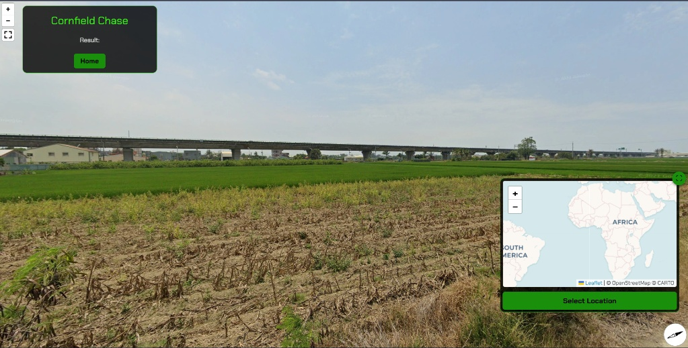
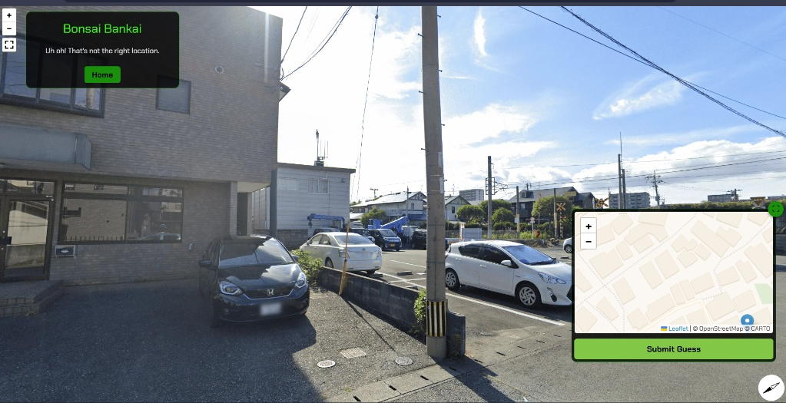

# OSINT
So first I tried out OSINT as I though it would be easy.

## Cornfield Chase

- First, I carefully looked at the image and tried to understand what kind of place it could be.
- I noticed a utility pole in the image, which felt important, so I focused mainly on that.
- The pole had some Chinese text and a few unusual codes written on it.
- I translated the Chinese text to understand what it meant.
- After translating and searching those codes online, I realized they were related to Taiwan.
- With more searching, I found out that these markings are used by the Taiwan Power Supply.
- I searched and found a page: https://www.taipower.com.tw/2763/
- From there, I found an address linked to the information: `No.242, Sec. 3, Roosevelt Rd., Zhongzheng District, Taipei City, Taiwan`.
- I tried checking this location and nearby areas multiple times.
- Even after many attempts, I couldn’t fully narrow it down to the exact spot on my own.
- Still, the utility pole, the Chinese text, and the Taiwan power supply connection were the main clues I followed throughout the challenge.

So after that I left the challenge due to lack of time...

## Bonsai Bankai

- First I looked at the image and felt it looked like Japan.
- The houses and the signs looked Japanese, so I focused on Japan.
- I tried reading the text in the image and found it says “Meikaen Bun'en”.
- I searched the meaning and found it means “Meikaen Branch Garden”.
- Then I searched for this place in Japan.
- I found a place called Hanyu and thought this might be the correct area.
- I saw that Hanyu is close to Hanyu Station on the Tobu Line.
    
- I opened maps and started looking around Hanyu in all directions.
- I spent around 3 to 4 hours checking roads, buildings, and nearby areas.
- Later, I got a hint saying to follow the train tracks towards the north-west.
- The hint also mentioned a level crossing near a dental clinic.
- I tried to find that crossing on the map.
- Even after many tries, I could not match the exact place.
- In the end, I was not able to reach the final location.

## The Flash
- First, the image was very blurred and hard to understand.
- At the start I thought the place might be outside India.
- After looking again at the trees and surroundings I felt it could be in India.
- I focused more on the trees shown in the image.
- I searched online to learn where such trees are commonly found.
- After some research, I found that these trees are seen in Ooty(India).
- I searched for Ooty on maps and started exploring nearby areas.
- I spent around 2–3 hours trying to match the place with street view.
- I checked many roads and locations but could not find the exact spot.
- Even after many attempts, I was not able to reach the final location.

## Graph Grief
- I opened the challenge website at https://grief.chals.nitectf25.live and saw that it was mostly a static landing page.
- I carefully read the page content and noticed multiple hints related to GraphQL, graph-based systems, and a “Legacy XML Bridge”.
- I saw a sample GraphQL query written directly on the webpage, which suggested that a backend GraphQL API existed.
- I manually tried accessing the GraphQL endpoint at https://grief.chals.nitectf25.live/graphql.
- I sent a basic GraphQL query `{ __typename }` to the endpoint and confirmed that the GraphQL service was active.
- But after trying many different techniques and searching for similar GraphQL challenges on YouTube, I was still not able to fully solve and complete the challenge.